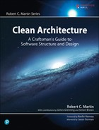

# Clean Architecture 中文

  

## 序

## 目录

- [第一部分 概述](part1.md)
- [第 1 章 设计与架构究竟是什么](ch1.md)
- [第 2 章 两个价值维度](ch2.md)

---

- [第二部分 从基础构件开始：编程范式](part2.md)
- [第 3 章 编程范式总览](ch3.md)
- [第 4 章 结构化编程](ch4.md)
- [第 5 章 面向对象编程](ch5.md)
- [第 6 章 函数式编程](ch6.md)

---

- [第三部分 设计原则](part3.md)
- [第 7 章 SRP：单一职责原则](ch7.md)
- [第 8 章 OCP：开闭原则](ch8.md)
- [第 9 章 LSP：里氏替换原则](ch9.md)
- [第 10 章 ISP：接口隔离原则](ch10.md)
- [第 11 章 DIP：依赖反转原则](ch11.md)

---

- [第四部分 组件构建原则](part4.md)
- [第 12 章 组件](c12.md)
- [第 13 章 组件聚合](ch13.md)
- [第 14 章 组件耦合](ch14.md)

---

- [第五部分 软件架构](part5.md)
- [第 15 章 什么是软件架构](ch15.md)
- [第 16 章 独立性](ch16.md)
- [第 17 章 划分边界](ch17.md)
- [第 18 章 边界剖析](ch18.md)
- [第 19 章 策略与层次](ch19.md)
- [第 20 章 业务逻辑](ch20.md)
- [第 21 章 尖叫的软件架构](ch21.md)
- [第 22 章 整洁架构](ch22.md)
- [第 23 章 展示器和谦卑对象](ch23.md)
- [第 24 章 不完全边界](ch24.md)
- [第 25 章 层次与边界](ch25.md)
- [第 26 章 Main 组件](ch26.md)
- [第 27 章 服务：宏观和微观](ch27.md)
- [第 28 章 测试边界](ch28.md)
- [第 29 章 整洁的嵌入式架构](ch29.md)

---

- [第六部分 实现细节](part6.md)
- [第 30 章 数据库只是实现细节](ch30.md)
- [第 31 章 Web 是实现细节](ch31.md)
- [第 32 章 应用程序框架是实现细节](ch32.md)
- [第 33 章 案例分析：视频销售网站](ch33.md)
- [第 34 章 拾遗](ch34.md)
