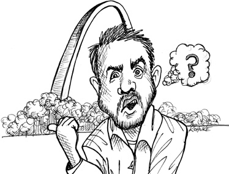

# Chap1. WHAT IS DESIGN AND ARCHITECTURE? 设计与架构到底是什么

There has been a lot of confusion about design and architecture over the years. What is design? What is architecture? What are the differences between the two?

> 一直以来，设计（Design）与架构（Architecture）这两个概念让大多数人十分迷惑——什么是设计？什么是架构？二者究竟有什么区别？

One of the goals of this book is to cut through all that confusion and to define, once and for all, what design and architecture are. For starters, I’ll assert that there is no difference between them. None at all.

> 本书的一个重要的目标就是要清晰、明确地对二者进行定义。首先我要明确地说，二者没有任何区别。一丁点区别都没有！

The word “architecture” is often used in the context of something at a high level that is divorced from the lower-level details, whereas “design” more often seems to imply structures and decisions at a lower level. But this usage is nonsensical when you look at what a real architect does.

> “架构”这个词往往使用于“高层级”的讨论中。这类讨论一般都把“底层”的实现细节排除在外。而“设计”一词，往往用来指代具体的系统底层组织结构和实现的细节。但是，从一个真正的系统架构师的日常工作来看，这样的区分是根本不成立的。

Consider the architect who designed my new home. Does this home have an architecture? Of course it does. And what is that architecture? Well, it is the shape of the home, the outward appearance, the elevations, and the layout of the spaces and rooms. But as I look through the diagrams that my architect produced, I see an immense number of low-level details. I see where every outlet, light switch, and light will be placed. I see which switches control which lights. I see where the furnace is placed, and the size and placement of the water heater and the sump pump. I see detailed depictions of how the walls, roofs, and foundations will be constructed.

> 以给我设计新房子的建筑设计师要做的事情为例。新房子当然是存在着既定架构的，但这个架构具体包含哪些内容呢？首先，它应该包括房屋的形状、外观设计、垂直高度、房间的布局，等等。但是，如果查看建筑设计师使用的图纸，会发现其中也充斥着大量的设计细节。譬如，我们可以看到每个插座、开关以及每个电灯具体的安装位置，同时也可以看到某个开关与所控制的电灯的具体连接信息；我们也能看到壁炉的具体安装位置，热水器的大小和位置信息，甚至是污水泵的位置；同时也可以看到关于墙体、屋顶和地基都有非常详细的建造说明。

In short, I see all the little details that support all the high-level decisions. I also see that those low-level details and high-level decisions are part of the whole design of the house.

> 总的来说，架构图里实际上包含了所有的底层设计细节，这些细节信息共同支撑了顶层的架构设计，底层设计信息和顶层架构设计共同组成了整个房屋的架构文档。

And so it is with software design. The low-level details and the high-level structure are all part of the same whole. They form a continuous fabric that defines the shape of the system. You can’t have one without the other; indeed, no clear dividing line separates them. There is simply a continuum of decisions from the highest to the lowest levels.

> 软件设计也是如此。底层设计细节和高层架构信息是不可分割的。它们组合在一起，共同定义了整个软件系统，缺一不可。所谓的底层和高层本身就是一系列决策组成的连续体，并没有清晰的分界线。

## THE GOAL? 目标是什么

And the goal of those decisions? The goal of good software design? That goal is nothing less than my utopian description:

> 所有这些决策的终极目标是什么呢？ 一个好的软件设计的终极目标是什么呢？就像我之前描述过的：

The goal of software architecture is to minimize the human resources required to build and maintain the required system.

> 软件架构的终极目标是，用最小的人力成本来满足构建和维护该系统的需求。

The measure of design quality is simply the measure of the effort required to meet the needs of the customer. If that effort is low, and stays low throughout the lifetime of the system, the design is good. If that effort grows with each new release, the design is bad. It’s as simple as that.

> 一个软件架构的优劣，可以用它满足用户需求所需要的成本来衡量。如果该成本很低，并且在系统的整个生命周期内一直都能维持这样的低成本，那么这个系统的设计就是优良的。如果该系统的每次发布都会提升下一次变更的成本，那么这个设计就是不好的。就这么简单。

## CASE STUDY 案例分析

As an example, consider the following case study. It includes real data from a real company that wishes to remain anonymous.

> 下面来看一个真实案例，该案例中的数据均来源于一个要求匿名的真实公司。

First, let’s look at the growth of the engineering staff. I’m sure you’ll agree that this trend is very encouraging. Growth like that shown in Figure 1.1 must be an indication of significant success!

> 首先，我们来看一下工程师团队规模的增长。你肯定认为这个增长趋势是特别可喜的，像图 1.1 中的这种增长线条一定是公司业务取得巨大成功的直观体现。

<Figures figure="1-1">Growth of the engineering staff</Figures>

Reproduced with permission from a slide presentation by Jason Gorman

Now let’s look at the company’s productivity over the same time period, as measured by simple lines of code (Figure 1.2).

> 现在再让我们来看一下整个公司同期的生产效率（productivity），这里用简单的代码行数作为指标（参见图 1.2）。

<Figures figure="1-2">Productivity over the same period of time</Figures>

Clearly something is going wrong here. Even though every release is supported by an ever-increasing number of developers, the growth of the code looks like it is approaching an asymptote.

> 这明显是有问题的。伴随着产品的每次发布，公司的工程师团队在持续不断地扩展壮大，但是仅从代码行数的增长来看，该产品却正在逐渐陷入困境。

Now here’s the really scary graph: Figure 1.3 shows how the cost per line of code has changed over time.

> 还有更可怕的：图 1.3 展示的是同期内每行代码的变更成本。

These trends aren’t sustainable. It doesn’t matter how profitable the company might be at the moment: Those curves will catastrophically drain the profit from the business model and drive the company into a stall, if not into a downright collapse.

> 显然，图中展示的趋势是不可持续的。不管公司现在的利润率有多高，图中线条表明，按这个趋势下去，公司的利润会被一点点榨干，整个公司会因此陷入困境，甚至直接关门倒闭。

What caused this remarkable change in productivity? Why was the code 40 times more expensive to produce in release 8 as opposed to release 1?

> 究竟是什么因素造成生产力的大幅变化呢？为什么第 8 代产品的构建成本要 比第 1 代产品高 40 倍？

<Figures figure="1-3">Cost per line of code over time</Figures>

### THE SIGNATURE OF A MESS 乱麻系统的特点

What you are looking at is the signature of a mess. When systems are thrown together in a hurry, when the sheer number of programmers is the sole driver of output, and when little or no thought is given to the cleanliness of the code or the structure of the design, then you can bank on riding this curve to its ugly end.

> 我们在这里看到的是一个典型的乱麻系统。这种系统一般都是没有经过设计，匆匆忙忙被构建起来的。然后为了加快发布的速度，拼命地往团队里加入新人，同时加上决策层对代码质量提升和设计结构优化存在着持续的、长久的忽视，这种状态能持续下去就怪了。

Figure 1.4 shows what this curve looks like to the developers. They started out at nearly 100% productivity, but with each release their productivity declined. By the fourth release, it was clear that their productivity was going to bottom out in an asymptotic approach to zero.

> 图 1.4 展示了系统开发者的切身体会。他们一开始的效率都接近 100%，然而伴随着每次产品的发布，他们的生产力直线下降。到了产品的第 4 版本时，很明显大家的生产力已经不可避免地趋近为零了。

<Figures figure="1-4">Productivity by release</Figures>

From the developers’ point of view, this is tremendously frustrating, because everyone is working hard. Nobody has decreased their effort.

> 对系统的开发者来说，这会带来很大的挫败感，因为团队中并没有人偷懒，每个人还都是和之前一样在拼命工作。

And yet, despite all their heroics, overtime, and dedication, they simply aren’t getting much of anything done anymore. All their effort has been diverted away from features and is now consumed with managing the mess. Their job, such as it is, has changed into moving the mess from one place to the next, and the next, and the next, so that they can add one more meager little feature.

> 然而，不管他们投入了多少个人时间，救了多少次火，加了多少次班，他们的产出始终上不去。工程师的大部分时间都消耗在对现有系统的修修补补上，而不是真正完成实际的新功能。这些工程师真正的任务是：拆了东墙补西墙，周而往复，偶尔有精力能顺便实现一点小功能。

### THE EXECUTIVE VIEW 管理层视角

If you think that’s bad, imagine what this picture looks like to the executives! Consider Figure 1.5, which depicts monthly development payroll for the same period.

> 如果你觉得开发者们这样就已经够苦了，那么就再想想公司髙管们的感受吧! 请看图 1.5，该部门月工资同期图。

<Figures figure="1-5">Monthly development payroll by release</Figures>

Release 1 was delivered with a monthly payroll of a few hundred thousand dollars. The second release cost a few hundred thousand more. By the eighth release monthly payroll was `$20` million, and climbing.

> 如你所见，产品的第 1 版是在月总工资 10 万美元左右的时候上线的。第 2 版又花掉了几十万美元。当发布第 8 版的时候，部门月工资已经达到了 2 千万美元，而且还在持续上升。

Just this chart alone is scary. Clearly something startling is happening. One hopes that revenues are outpacing costs and therefore justifying the expense. But no matter how you look at this curve, it’s cause for concern.

> 也许我们可以指望该公司的营收增长远远超出成本增长，这样公司就还能维持正常运转。但是这么惊人的曲线还是值得我们深入挖掘其中存在的巨大问题的。

But now compare the curve in Figure 1.5 with the lines of code written per release in Figure 1.2. That initial few hundred thousand dollars per month bought a lot of functionality—but the final `$20` million bought almost nothing! Any CFO would look at these two graphs and know that immediate action is necessary to stave off disaster.

> 现在，只要将图 1.5 的月工资曲线和图 1.2 的每次发布代码行数曲线对比一下，任何一个理性的 CEO 都会一眼看出其中的问题：最开始的十几万美元工资给公司带来了很多新功能、新收益，而最后的 2 千万美元几乎全打了水漂。应立刻采取行动解决这个问题，刻不容缓。

But which action can be taken? What has gone wrong? What has caused this incredible decline in productivity? What can executives do, other than to stamp their feet and rage at the developers?

> 但是具体采取什么样的行动才能解决问题呢？究竟问题出在哪里？是什么造成了工程师生产力的直线下降？高管们除了跺脚、发飙，还能做什么呢？

### WHAT WENT WRONG? 问题到底在哪里

Nearly 2600 years ago, Aesop told the story of the Tortoise and the Hare. The moral of that story has been stated many times in many different ways:

> 大约 2600 年前，《伊索寓言》里写到了龟兔赛跑的故事。这个故事的主题思想可以归纳为以下几种：

- “Slow and steady wins the race.”
- “The race is not to the swift, nor the battle to the strong.”
- “The more haste, the less speed.”

---

> 1. 慢但是稳，是成功的秘诀。
> 2. 该比赛并不是拼谁开始跑得快，也不是拼谁更有力气的。
> 3. 心态越急，反而跑得越慢。

The story itself illustrates the foolishness of overconfidence. The Hare, so confident in its intrinsic speed, does not take the race seriously, and so naps while the Tortoise crosses the finish line.

> 这个故事本身揭露的是过度自信的愚蠢行为。兔子由于对自己速度的过度自信，没有把乌龟当回事，结果乌龟爬过终点线取得胜利的时候，它还在睡觉。

Modern developers are in a similar race, and exhibit a similar overconfidence. Oh, they don’t sleep—far from it. Most modern developers work their butts off. But a part of their brain does sleep—the part that knows that good, clean, well-designed code matters.

> 这和现代软件研发工作有点类似，现在的软件研发工程师都有点过于自信。哦，当然，他们确实不会偷懒，一点也不。但是他们真正偷懒的地方在于——持续低估那些好的、良好设计的、整洁的代码的重要性。

These developers buy into a familiar lie: “We can clean it up later; we just have to get to market first!” Of course, things never do get cleaned up later, because market pressures never abate. Getting to market first simply means that you’ve now got a horde of competitors on your tail, and you have to stay ahead of them by running as fast as you can.

> 这些工程师们普遍用一句话来欺骗自己：“我们可以未来再重构代码，产品上线最重要！”但是结果大家都知道，产品上线以后重构工作就再没人提起了。市场的压力永远也不会消退，作为首先上市的产品，后面有无数的竞争对手追赶，必须要比他们跑得更快才能保持领先。

And so the developers never switch modes. They can’t go back and clean things up because they’ve got to get the next feature done, and the next, and the next, and the next. And so the mess builds, and productivity continues its asymptotic approach toward zero.

> 所以，重构的时机永远不会再有了。工程师们忙于完成新功能，新功能做不完，哪有时间重构老的代码？循环往复，系统成了一团乱麻，主产效率持续直线下降，直至为零。

Just as the Hare was overconfident in its speed, so the developers are overconfident in their ability to remain productive. But the creeping mess of code that saps their productivity never sleeps and never relents. If given its way, it will reduce productivity to zero in a matter of months.

> 结果就像龟兔赛跑中过于自信的兔子一样，软件研发工程师们对自己保持高产出的能力过于自信了。但是乱成一团的系统代码可没有休息时间，也不会放松。如果不严加提防，在几个月之内，整个研发团队就会陷入困境。

The bigger lie that developers buy into is the notion that writing messy code makes them go fast in the short term, and just slows them down in the long term. Developers who accept this lie exhibit the hare’s overconfidence in their ability to switch modes from making messes to cleaning up messes sometime in the future, but they also make a simple error of fact. The fact is that making messes is always slower than staying clean, no matter which time scale you are using.

> 工程师们经常相信的另外一个错误观点是： “在工程中容忍糟糕的代码存在可以在短期内加快该工程上线的速度，未来这些代码会造成一些额外的工作量，但是并没有什么大不了。”相信这些鬼话的工程师对自己清理乱麻代码的能力过于自信了。但是更重要的是，他们还忽视了一个自然规律：无论是从短期还是长期来看，胡乱编写代码的工作速度其实比循规蹈矩更慢。

Consider the results of a remarkable experiment performed by Jason Gorman depicted in Figure 1.6. Jason conducted this test over a period of six days. Each day he completed a simple program to convert integers into Roman numerals. He knew his work was complete when his predefined set of acceptance tests passed. Each day the task took a little less than 30 minutes. Jason used a well-known cleanliness discipline named test-driven development (TDD) on the first, third, and fifth days. On the other three days, he wrote the code without that discipline.

> 图 1.6 展示的是 Jason Gorman 进行的一次为期 6 天的实验。在该实验中，Jason 每天都编写一段代码，功能是将一个整数转化为相应罗马数字的字符串。当事先定义好的一个测试集完全通过时，即认为当天工作完成。每天实验的时长不超过 30 分钟。第一天、第三天和第五天，Jason 在编写代码的过程中采用了业界知名的优质代码方法论：测试驱动开发（TDD），而其他三天他则直接从头开始编写代码。

<Figures figure="1-6">Time to completion by iterations and use/non-use of TDD</Figures>

First, notice the learning curve apparent in Figure 1.6. Work on the latter days is completed more quickly than the former days. Notice also that work on the TDD days proceeded approximately 10% faster than work on the non-TDD days, and that even the slowest TDD day was faster than the fastest non-TDD day.

> 首先，我们要关注的是图 1.6 中那些柱状图。很显然，日子越往后，完成工作所需的时间就越少。同时，我们也可以看到当人们采用了 TDD 方法编程后，一般就会比未采用 TDD 方法编程少用 10%的时间，并且采用 TDD 方法编程时最差的一天也比未采用 TDD 方法编程时最好的一天用时要短。

Some folks might look at that result and think it’s a remarkable outcome. But to those who haven’t been deluded by the Hare’s overconfidence, the result is expected, because they know this simple truth of software development:

> 对于这个结果，有些人可能会觉得挺意外的。但是对常年关注软件开发本质的人来说，它其实揭示了软件开发的一个核心特点：

The only way to go fast, is to go well.

> 要想跑得快，先要跑得稳。

And that’s the answer to the executive’s dilemma. The only way to reverse the decline in productivity and the increase in cost is to get the developers to stop thinking like the overconfident Hare and start taking responsibility for the mess that they’ve made.

> 综上所述，管理层扭转局面的唯一选择就是扭转开发者的观念，让他们从过度自信的兔子模式转变回来，为自己构建的乱麻系统负起责任来。

The developers may think that the answer is to start over from scratch and redesign the whole system—but that’s just the Hare talking again. The same overconfidence that led to the mess is now telling them that they can build it better if only they can start the race over. The reality is less rosy:

> 当然，某些软件研发工程师可能会认为挽救一个系统的唯一办法是抛弃现有系统，设计一个全新的系统来替代。但是这里仍然没有逃离过度自信。试问：如果是工程师的过度自信导致了目前的一团乱麻，那么重新开始，结果凭什么就会更好呢？

Their overconfidence will drive the redesign into the same mess as the original project.

> 那么，我们有理由认为：让他们从头重构设计，将陷入和原项目一样的困局之中。

## CONCLUSION 本章小结

In every case, the best option is for the development organization to recognize and avoid its own overconfidence and to start taking the quality of its software architecture seriously.

> 不管怎么看，研发团队最好的选择是清晰地认识并避开工程师们过度自信的特点，开始认真地对待自己的代码架构，对其质量负责。

To take software architecture seriously, you need to know what good software architecture is. To build a system with a design and an architecture that minimize effort and maximize productivity, you need to know which attributes of system architecture lead to that end.

> 要想提高自己软件架构的质量，就需要先知道什么是优秀的软件架构。而为了在系统构建过程中采用好的设计和架构以便减少构建成本，提高生产力，又需要先了解系统架构的各种属性与成本和生产力的关系。

That’s what this book is about. It describes what good clean architectures and designs look like, so that software developers can build systems that will have long profitable lifetimes.

> 这就是这本书的主题。本书为读者描述了什么是优秀的、整洁的软件架构与设计，读者可以参考这些设计来构建一个长期稳定的、持久优秀的系统。
