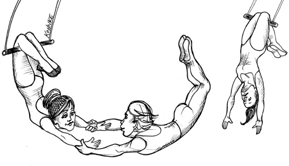

# 第 11 章 DIP: THE DEPENDENCY INVERSION PRINCIPLE

The Dependency Inversion Principle (DIP) tells us that the most flexible systems are those in which source code dependencies refer only to abstractions, not to concretions.

In a statically typed language, like Java, this means that the use, import, and include statements should refer only to source modules containing interfaces, abstract classes, or some other kind of abstract declaration. Nothing concrete should be depended on.

The same rule applies for dynamically typed languages, like Ruby and Python. Source code dependencies should not refer to concrete modules. However, in these languages it is a bit harder to define what a concrete module is. In particular, it is any module in which the functions being called are implemented.

Clearly, treating this idea as a rule is unrealistic, because software systems must depend on many concrete facilities. For example, the String class in Java is concrete, and it would be unrealistic to try to force it to be abstract. The source code dependency on the concrete java.lang.string cannot, and should not, be avoided.

By comparison, the String class is very stable. Changes to that class are very rare and tightly controlled. Programmers and architects do not have to worry about frequent and capricious changes to String.

For these reasons, we tend to ignore the stable background of operating system and platform facilities when it comes to DIP. We tolerate those concrete dependencies because we know we can rely on them not to change.

It is the volatile concrete elements of our system that we want to avoid depending on. Those are the modules that we are actively developing, and that are undergoing frequent change.

STABLE ABSTRACTIONS
Every change to an abstract interface corresponds to a change to its concrete implementations. Conversely, changes to concrete implementations do not always, or even usually, require changes to the interfaces that they implement. Therefore interfaces are less volatile than implementations.

Indeed, good software designers and architects work hard to reduce the volatility of interfaces. They try to find ways to add functionality to implementations without making changes to the interfaces. This is Software Design 101.

The implication, then, is that stable software architectures are those that avoid depending on volatile concretions, and that favor the use of stable abstract interfaces. This implication boils down to a set of very specific coding practices:

• Don’t refer to volatile concrete classes. Refer to abstract interfaces instead. This rule applies in all languages, whether statically or dynamically typed. It also puts severe constraints on the creation of objects and generally enforces the use of Abstract Factories.

• Don’t derive from volatile concrete classes. This is a corollary to the previous rule, but it bears special mention. In statically typed languages, inheritance is the strongest, and most rigid, of all the source code relationships; consequently, it should be used with great care. In dynamically typed languages, inheritance is less of a problem, but it is still a dependency—and caution is always the wisest choice.

• Don’t override concrete functions. Concrete functions often require source code dependencies. When you override those functions, you do not eliminate those dependencies—indeed, you inherit them. To manage those dependencies, you should make the function abstract and create multiple implementations.

• Never mention the name of anything concrete and volatile. This is really just a restatement of the principle itself.

FACTORIES
To comply with these rules, the creation of volatile concrete objects requires special handling. This caution is warranted because, in virtually all languages, the creation of an object requires a source code dependency on the concrete definition of that object.

In most object-oriented languages, such as Java, we would use an Abstract Factory to manage this undesirable dependency.

The diagram in Figure 11.1 shows the structure. The Application uses the ConcreteImpl through the Service interface. However, the Application must somehow create instances of the ConcreteImpl. To achieve this without creating a source code dependency on the ConcreteImpl, the Application calls the makeSvc method of the ServiceFactory interface. This method is implemented by the ServiceFactoryImpl class, which derives from ServiceFactory. That implementation instantiates the ConcreteImpl and returns it as a Service.

<Figures figure="11-1">Use of the Abstract Factory pattern to manage the dependency</Figures>

The curved line in Figure 11.1 is an architectural boundary. It separates the abstract from the concrete. All source code dependencies cross that curved line pointing in the same direction, toward the abstract side.

The curved line divides the system into two components: one abstract and the other concrete. The abstract component contains all the high-level business rules of the application. The concrete component contains all the implementation details that those business rules manipulate.

Note that the flow of control crosses the curved line in the opposite direction of the source code dependencies. The source code dependencies are inverted against the flow of control—which is why we refer to this principle as Dependency Inversion.

CONCRETE COMPONENTS
The concrete component in Figure 11.1 contains a single dependency, so it violates the DIP. This is typical. DIP violations cannot be entirely removed, but they can be gathered into a small number of concrete components and kept separate from the rest of the system.

Most systems will contain at least one such concrete component—often called main because it contains the main1 function. In the case illustrated in Figure 11.1, the main function would instantiate the ServiceFactoryImpl and place that instance in a global variable of type ServiceFactory. The Application would then access the factory through that global variable.

CONCLUSION
As we move forward in this book and cover higher-level architectural principles, the DIP will show up again and again. It will be the most visible organizing principle in our architecture diagrams. The curved line in Figure 11.1 will become the architectural boundaries in later chapters. The way the dependencies cross that curved line in one direction, and toward more abstract entities, will become a new rule that we will call the Dependency Rule.