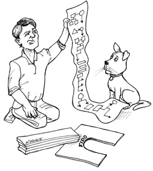

# Chap15. WHAT IS ARCHITECTURE? 什么是软件架构



The word “architecture” conjures visions of power and mystery. It makes us think of weighty decisions and deep technical prowess. Software architecture is at the pinnacle of technical achievement. When we think of a software architect, we think of someone who has power, and who commands respect. What young aspiring software developer has not dreamed of one day becoming a software architect?

> “架构”这个词给人的直观感受就充满了权力与神秘感，因此谈论架构总让人有一种正在进行责任重大的决策或者深度技术分析的感觉。毕竟，进阶到软件架构这一层次是我们走技术路线的人的终极目标。一个软件架构师总是给人一种权力非凡、广受尊敬的感觉，有哪个年轻的工程师没有梦想过成为一个软件架构师呢?

But what is software architecture? What does a software architect do, and when does he or she do it?

> 那么，究竟什么才是“软件架构”呢?软件架构师的工作内容究竟是什么?这项工作又是什么时候进行的呢？

First of all, a software architect is a programmer; and continues to be a programmer. Never fall for the lie that suggests that software architects pull back from code to focus on higher-level issues. They do not! Software architects are the best programmers, and they continue to take programming tasks, while they also guide the rest of the team toward a design that maximizes productivity. Software architects may not write as much code as other programmers do, but they continue to engage in programming tasks. They do this because they cannot do their jobs properly if they are not experiencing the problems that they are creating for the rest of the programmers.

> 首先，软件架构师自身需要是程序员，并且必须一直坚持做一线程序员，绝对不要听从那些说应该让软件架构师从代码中解放出来以专心解决高阶问题的伪建议。不是这样的！软件架构师其实应该是能力最强的一群程序员，他们通常会在自身承接编程任务的同时。逐渐引导整个团队向一个能够最大化生产力的系统设计方向前进。也许软件架构师生产的代码量不是最多的，但是他们必须不停地承接编程任务。如果不亲身承受因系统设计而带来的麻烦，就体会不到设计不佳所带来的痛苦，接着就会逐渐迷失正确的设计方向。

The architecture of a software system is the shape given to that system by those who build it. The form of that shape is in the division of that system into components, the arrangement of those components, and the ways in which those components communicate with each other.

> 软件系统的架构质量是由它的构建者所决定的，软件架构这项工作的实质就是规划如何将系统切分成组件，并安排好组件之间的排列关系，以及组件之间互相通信的方式。

The purpose of that shape is to facilitate the development, deployment, operation, and maintenance of the software system contained within it.

> 而设计软件架构的目的，就是为了在工作中更好地对这些组件进行研发、部署、运行以及维护。

The strategy behind that facilitation is to leave as many options open as possible, for as long as possible.

> 如果想设计一个便于推进各项工作的系统，其策略就是要在设计中尽可能长时间地保留尽可能多的可选项。

Perhaps this statement has surprised you. Perhaps you thought that the goal of software architecture was to make the system work properly. Certainly we want the system to work properly, and certainly the architecture of the system must support that as one of its highest priorities.

> 上面这句话可能会让人很意外，也许你一直认为设计软件架构的目的应该是让一个系统能正常地工作。我们当然需要让系统正常工作，软件架构设计最高优先级的目标就是保持系统正常工作。

However, the architecture of a system has very little bearing on whether that system works. There are many systems out there, with terrible architectures, that work just fine. Their troubles do not lie in their operation; rather, they occur in their deployment, maintenance, and ongoing development.

> 然而，一个软件系统的架构质量和该系统是否能正常工作的关系并不大，毕竟世界上有很多架构设计糟糕但是工作正常的软件系统。真正的麻烦往往并不会在我们运行软件的过程中出现，而是会出现在这个软件系统的开发、部署以及后续的补充开发中。

This is not to say that architecture plays no role in supporting the proper behavior of the system. It certainly does, and that role is critical. But the role is passive and cosmetic, not active or essential. There are few, if any, behavioral options that the architecture of a system can leave open.

> 当然，这并不意味着好的软件架构对系统的行为就没有影响了，事实上架构在其中的角色还是很重要的。然而在这个方面，架构能起到的作用更多的时候是被动的，修饰性的，并不是主动的，更不是必不可少的。在系统的架构设计中，能影响系统行为的可选项少之又少。

The primary purpose of architecture is to support the life cycle of the system. Good architecture makes the system easy to understand, easy to develop, easy to maintain, and easy to deploy. The ultimate goal is to minimize the lifetime cost of the system and to maximize programmer productivity.

> 软件架构设计的主要目标是支撑软件系统的全生命周期，设计良好的架构可以让系统便于理解、易于修改、方便维护，并且能轻松部署。软件架构的终极目标就是最大化程序员的生产力，同时最小化系统的总运营成本。

## DEVELOPMENT 开发（Development）

A software system that is hard to develop is not likely to have a long and healthy lifetime. So the architecture of a system should make that system easy to develop, for the team(s) who develop it.

> 一个开发起来很困难的软件系统一般不太可能会有一个长久、健康的生命周期，所以系统架构的作用就是要方便其开发团队对它的开发。

Different team structures imply different architectural decisions. On the one hand, a small team of five developers can quite effectively work together to develop a monolithic system without well-defined components or interfaces. In fact, such a team would likely find the strictures of an architecture something of an impediment during the early days of development. This is likely the reason why so many systems lack good architecture: They were begun with none, because the team was small and did not want the impediment of a superstructure.

> 这意味着，不同的团队结构应该采用不同的架构设计。一方面，对于一个只有五个开发人员的小团队来说，他们完全可以非常高效地共同开发一个没有明确定义组件和接口的单体系统（monolithic system）。事实上，这样的团队可能会发现软件架构在早期开发中反而是一种障碍。这可能就是为什么许多系统都没有设计一个良好架构的原因，因为它们的开发团队起初都很小，不需要设计一些上层建筑来限制某些事情。

On the other hand, a system being developed by five different teams, each of which includes seven developers, cannot make progress unless the system is divided into well-defined components with reliably stable interfaces. If no other factors are considered, the architecture of that system will likely evolve into five components—one for each team.

> 但另一方面，如果一个软件系统是由五个不同的团队合作开发的，而每个团队各自都有七个开发人员的话，不将系统划分成定义清晰的组件和可靠稳定的接口，开发工作就没法继续推进。通常，如果忽略其他因素，该系统的架构会逐渐演变成五个组件，一个组件对应一个团队。

Such a component-per-team architecture is not likely to be the best architecture for deployment, operation, and maintenance of the system. Nevertheless, it is the architecture that a group of teams will gravitate toward if they are driven solely by development schedule.

> 当然，这种一个组件对应一个团队的架构不太可能是该系统在部署、运行以及维护方面的最优方案。但不管怎样，如果研发团队只受开发进度来驱动的话，他们的架构设计最终一定会倾向于这个方向。

## DEPLOYMENT 部署（Deployment）

To be effective, a software system must be deployable. The higher the cost of deployment, the less useful the system is. A goal of a software architecture, then, should be to make a system that can be easily deployed with a single action.

> 为了让开发成为有效的工作，软件系统就必须是可部署的。在通常情况下，一个系统的部署成本越高，可用性就越低。因此，实现一键式的轻松部署应该是我们设计软件架构的一个目标。

Unfortunately, deployment strategy is seldom considered during initial development. This leads to architectures that may make the system easy to develop, but leave it very difficult to deploy.

> 但很不幸，我们在系统的早期开发中很少会考虑部署策略方面的事情，这常常会导致一些易于开发、难于部署的系统架构。

For example, in the early development of a system, the developers may decide to use a “micro-service architecture.” They may find that this approach makes the system very easy to develop since the component boundaries are very firm and the interfaces relatively stable. However, when it comes time to deploy the system, they may discover that the number of micro-services has become daunting; configuring the connections between them, and the timing of their initiation, may also turn out to be a huge source of errors.

> 例如，在系统的早期开发中，开发人员可能会决定采用某种“微服务架构”。这种架构的组件边界清晰，接口稳定，非常利于开发。但当我们实际部署这种系统时，就会发现其微服务的数量已经大到令人望而生畏，而配置这些微服务之间的连接以及启动时间都会成为系统出错的主要来源。

Had the architects considered deployment issues early on, they might have decided on fewer services, a hybrid of services and in-process components, and a more integrated means of managing the interconnections.

> 如果软件架构师早先就考虑到这些部署问题，可能就会有意地减少微服务的数量，采用进程内部组件与外部服务混合的架构，以及更加集成式的连接管理方式。

## OPERATION 运行（Operation）

The impact of architecture on system operation tends to be less dramatic than the impact of architecture on development, deployment, and maintenance. Almost any operational difficulty can be resolved by throwing more hardware at the system without drastically impacting the software architecture.

> 软件架构对系统运行的影响远不及它对开发、部署和维护的影响。几乎任何运行问题都可以通过增加硬件的方式来解决，这避免了软件架构的重新设计。

Indeed, we have seen this happen over and over again. Software systems that have inefficient architectures can often be made to work effectively simply by adding more storage and more servers. The fact that hardware is cheap and people are expensive means that architectures that impede operation are not as costly as architectures that impede development, deployment, and maintenance.

> 事实上，我们长期以来就是一直目睹着这种情况一再发生。对于一个因架构设计糟糕而效率低下的系统，我们通常只需要增加更多的存储器与服务器，就能够让它完满地完成任务。另外，硬件也远比人力要便宜，这也是软件架构对系统运行的影响远没有它对开发、部署、维护的影响那么深远的一个原因。

This is not to say that an architecture that is well tuned to the operation of the system is not desirable. It is! It’s just that the cost equation leans more toward development, deployment, and maintenance.

> 当然，这并不是说我们不应该为了让系统能更好地运转而优化软件的架构设计，这样做是应该的，只是基于投入/产出比的考虑，我们的优化重心应该更倾向于系统的开发、部署以及维护。

Having said that, there is another role that architecture plays in the operation of the system: A good software architecture communicates the operational needs of the system.

> 即使这样，软件架构在整个系统运行的过程中还发挥着另外一个重要作用，那就是一个设计良好的软件架构应该能明确地反映该系统在运行时的需求。

Perhaps a better way to say this is that the architecture of a system makes the operation of the system readily apparent to the developers. Architecture should reveal operation. The architecture of the system should elevate the use cases, the features, and the required behaviors of the system to first-class entities that are visible landmarks for the developers. This simplifies the understanding of the system and, therefore, greatly aids in development and maintenance.

> 也许我们可以换一个更好的说法，那就是设计良好的系架构应该可以使开发人员对系统的运行过程一目了然。架构应该起到揭示系统运行过程的作用。具体来说，就是该架构应该将系统中的用例、功能以及该系统的必备行为设置为对开发者可见的一级实体，简化它们对于系统的理解，这将为整个系统的开发与维护提供很大的帮助。

## MAINTENANCE 维护（Maintenance）

Of all the aspects of a software system, maintenance is the most costly. The never-ending parade of new features and the inevitable trail of defects and corrections consume vast amounts of human resources.

> 在软件系统的所有方面中，维护所需的成本是最高的。满足永不停歇的新功能需求，以及修改层出不穷的系统缺陷这些工作将会占去绝大部分的人力资源。

The primary cost of maintenance is in spelunking and risk. Spelunking is the cost of digging through the existing software, trying to determine the best place and the best strategy to add a new feature or to repair a defect. While making such changes, the likelihood of creating inadvertent defects is always there, adding to the cost of risk.

> 系统维护的主要成本集中在“探秘”和“风险”这两件事上。其中，“探秘（spelunking）”的成本主要来自我们对于现有软件系统的挖掘，目的是确定新增功能或被修复问题的最佳位置和最佳方式。而“风险（risk）”，则是指当我们进行上述修改时，总是有可能衍生出新的问题，这种可能性就是风险成本。

A carefully thought-through architecture vastly mitigates these costs. By separating the system into components, and isolating those components through stable interfaces, it is possible to illuminate the pathways for future features and greatly reduce the risk of inadvertent breakage.

> 我们可以通过精雕细琢的架构设计极大地降低这两项成本。通过将系统切分为组件，并使用稳定的接口将组件隔离，我们可以将未来新功能的添加方式明确出来，并大幅度地降低在修改过程中对系统其他部分造成伤害的可能性。

## KEEPING OPTIONS OPEN 保持可选项

As we described in an earlier chapter, software has two types of value: the value of its behavior and the value of its structure. The second of these is the greater of the two because it is this value that makes software soft.

> 正如我们在之前章节中所说的，软件有行为价值与架构价值两种价值。这其中的第二种价值又比第一种更重要，因为它正是软件之所以“软”的原因。

Software was invented because we needed a way to quickly and easily change the behavior of machines. But that flexibility depends critically on the shape of the system, the arrangement of its components, and the way those components are interconnected.

> 软件被发明出来就是因为我们需要一种灵活和便捷的方式来改变机器的行为。而软件的灵活性则取决于系统的整体状况、组件的布置以及组件之间的连接方式。

The way you keep software soft is to leave as many options open as possible, for as long as possible. What are the options that we need to leave open? They are the details that don’t matter.

> 我们让软件维持“软”性的方法就是尽可能长时间地留下尽可能多的开放选项。那么到底哪些选项是我们应该保持开放的？它们就是那些无关紧要的细节设计。

All software systems can be decomposed into two major elements: policy and details. The policy element embodies all the business rules and procedures. The policy is where the true value of the system lives.

> 基本上，所有的软件系统部可以降解为两种主要元素：策略和细节。策略体现的是软件中所有的业务规则与操作过程，因此它是系统真正的价值所在。

The details are those things that are necessary to enable humans, other systems, and programmers to communicate with the policy, but that do not impact the behavior of the policy at all. They include IO devices, databases, web systems, servers, frameworks, communication protocols, and so forth.

> 而细节则是指那些让操作该系统的人、其他系统以及程序员们与策略进行交互，但是又不会影响到策略本身的行为。它们包括 I/O 设备、数据库、Web 系统、服务器、框架、交互协议等。

The goal of the architect is to create a shape for the system that recognizes policy as the most essential element of the system while making the details irrelevant to that policy. This allows decisions about those details to be delayed and deferred.

> 软件架构师的目标是创建一种系统形态，该形态会以策略为最基本的元素，并让细节与策略脱离关系，以允许在具体决策过程中推迟或延迟与细节相关的内容。

For example:

> 例如，

- It is not necessary to choose a database system in the early days of development, because the high-level policy should not care which kind of database will be used. Indeed, if the architect is careful, the high-level policy will not care if the database is relational, distributed, hierarchical, or just plain flat files.
- It is not necessary to choose a web server early in development, because the high-level policy should not know that it is being delivered over the web. If the high-level policy is unaware of HTML, AJAX, JSP, JSF, or any of the rest of the alphabet soup of web development, then you don’t need to decide which web system to use until much later in the project. Indeed, you don’t even have to decide if the system will be delivered over the web.
- It is not necessary to adopt REST early in development, because the high-level policy should be agnostic about the interface to the outside world. Nor is it necessary to adopt a micro-services framework, or a SOA framework. Again, the high-level policy should not care about these things.
- It is not necessary to adopt a dependency injection framework early in development, because the high-level policy should not care how dependencies are resolved.

---

> - 在开发的早期阶段应该无须选择数据库系统，因为软件的高层策略不应该关心其底层到底使用哪一种数据库。事实上，如果软件架构师足够小心，软件的高层策略甚至可以不用关心该数据库是关系型数据库，还是分布式数据库，是多级数据库，还只是一些文本文件而已。
> - 在开发的早期阶段也不应该选定使用的 Web 服务，因为高层策略并不应该知道自己未来要以网页形式发布。如果高层策略能够与 HTML、AJAX、JSP、JSF 或任何 Web 开发技术脱钩，那么我们就可以将对 Web 系统的选择推迟到项目的最后阶段。事实上，很有可能我们压根不需要考虑这个系统到底是不是以网页形式发布的。
> - 在开发的早期阶段不应该过早地采用 REST 模式，因为软件的高层策略应该与外部接口无关。同样的，我们也不应该过早地考虑采用微服务框架、SOA 框架等。再说一遍，软件的高层策略压根不应该跟这些有关。
> - 在开发的早期阶段不应过早地采用依赖注入框架（dependency injection framework），因为高层策略不应该操心如何解析系统的依赖关系。

I think you get the point. If you can develop the high-level policy without committing to the details that surround it, you can delay and defer decisions about those details for a long time. And the longer you wait to make those decisions, the more information you have with which to make them properly.

> 说到这里，我想读者应该明白我的意思了。如果在开发高层策略时有意地摆脱具体细节的纠缠，我们就可以将与具体实现相关的细节决策推迟或延后，因为越到项目的后期，我们就拥有越多的信息来做出合理的决策。

This also leaves you the option to try different experiments. If you have a portion of the high-level policy working, and it is agnostic about the database, you could try connecting it to several different databases to check applicability and performance. The same is true with web systems, web frameworks, or even the web itself.

> 同时，这样做还可以让我们有机会做不同的尝试。例如。如果我们现在手里有一部分与数据库无关的高层策略，那么我们就可以用不同的数据库来做实验，以检验该系统与不同数据库之间的适应性和性能。类似的情况也适用于各种 Web 框架，甚至 Web 这种发布形式本身。

The longer you leave options open, the more experiments you can run, the more things you can try, and the more information you will have when you reach the point at which those decisions can no longer be deferred.

> 另外，我们保留这些可选项的时间越长，实验的机会也就越多。而实验做得越多，我们做决策的时候就能拥有越充足的信息。

What if the decisions have already been made by someone else? What if your company has made a commitment to a certain database, or a certain web server, or a certain framework? A good architect pretends that the decision has not been made, and shapes the system such that those decisions can still be deferred or changed for as long as possible.

> 那么如果其他人已经替我们做出了决策呢？譬如说，我们的公司已经指定了某个数据库，或某种 Web 服务，或某个框架，这时应该怎么办？通常一个优秀的软件架构师会假装这些决策还没有确定，并尽可能长时间地让系统有推迟或修改这些决策的能力。

A good architect maximizes the number of decisions not made.

> 一个优秀的软件架构师应该致力于最大化可选项数量。

## DEVICE INDEPENDENCE 设备无关性

As an example of this kind of thinking, let’s take a trip back to the 1960s, when computers were teenagers and most programmers were mathematicians or engineers from other disciplines (and-one third or more were women).

> 如果想要找反映这方面思想的例子，我们还得先回到 20 世纪 60 年代。由于当时的计算机行业还处于萌芽阶段，大部分程序员都来自数学专业，或者是其他工程类专业（当时超过三分之一的程序员是女性）。

In those days we made a lot of mistakes. We didn’t know they were mistakes at the time, of course. How could we?

> 当时，我们曾经犯过很多错误，而且还没有人知道那些是错误。当然了，那时候我们怎么可能知道?

One of those mistakes was to bind our code directly to the IO devices. If we needed to print something on a printer, we wrote code that used the IO instructions that would control the printer. Our code was device dependent.

> 其中一个错误就是将代码与 I/O 设备直接紧密地绑定在一起。当时，如果我们需要用打印机打印东西，就得专门写一段 I/O 指令来操作打印机，因此我们的代码是依赖于设备的。

For example, when I wrote PDP-8 programs that printed on the teleprinter, I used a set of machine instructions that looked like this:

> 例如，当我们要写一段要在电传打印机上输出的 PDP-8 程序时，需要用到像下面这样一组机器指令：

```
PRTCHR, 0
        TSF
        JMP .-1
        TLS
        JMP I PRTCHR
```

PRTCHR is a subroutine that prints one character on the teleprinter. The beginning zero was used as the storage for the return address. (Don’t ask.) The TSF instruction skipped the next instruction if the teleprinter was ready to print a character. If the teleprinter was busy, then TSF just fell through to the JMP .-1 instruction, which just jumped back to the TSF instruction. If the teleprinter was ready, then TSF would skip to the TLS instruction, which sent the character in the A register to the teleprinter. Then the JMP I PRTCHR instruction returned to the caller.

> 这里的 PRTCHR 是电传打印机上一段用来打印字符的子程序。首语句中的 0 是存储其返回地址用的（这里就不要细究这些了）。下来是 TSF 指令，它的作用是告诉电传三印机如果准备就绪，就跳过下一指令。如果电传打印机处于繁忙状态，就继续执行 `JMP.-1` 指令，也就是再跳转回 TSF 指令。一旦电传打印机处于就绪状态，TSF 就会跳转到 TLS 指令，该指令会将 A 寄存器中保存的要打印的字符发送给电传打印机。随后，JMP I PRTCHR 指令会将程序返回给调用方。

At first this strategy worked fine. If we needed to read cards from the card reader, we used code that talked directly to the card reader. If we needed to punch cards, we wrote code that directly manipulated the punch. The programs worked perfectly. How could we know this was a mistake?

> 一开始，这一策略工作起来完全没有问题。如果我们需要从读卡器中读取卡片，我们就直接用代码与读卡器进行交互。如果我们需要在卡上打孔，就写一段代码直接控制打卡的过程。整套程序运行得非常完美。我们当时怎么会知道这是一个错误呢？

But big batches of punched cards are difficult to manage. They can be lost, mutilated, spindled, shuffled, or dropped. Individual cards can be lost and extra cards can be inserted. So data integrity became a significant problem.

> 然而，管理大量的卡片是一件很麻烦的事。这些卡片可能会出现丢失、损坏、旋转、排序错误等问题。各部分的卡片都有可能丢失或混入多余的卡片，保持数据的一致性是当时的一大难题。

Magnetic tape was the solution. We could move the card images to tape. If you drop a magnetic tape, the records don’t get shuffled. You can’t accidentally lose a record, or insert a blank record simply by handing the tape. The tape is much more secure. It’s also faster to read and write, and it is very easy to make backup copies.

> 后来就出现了磁带这种解决方案。它允许我们将原本打在卡片上的图像存储在磁带上。如果磁带不小心掉在地上，不会出现顺序被打乱的问题，我们也不会因此意外丢失记录，或者处理磁带时意外插入空白记录。显然，磁带是更安全的选择，而且它的读取和写入也更快，同时也很容易进行备份。

Unfortunately, all our software was written to manipulate card readers and card punches. Those programs had to be rewritten to use magnetic tape. That was a big job.

> 但不幸的是，我们当时所有的软件都是用于直接操作读卡器和打卡器的。为了让这些软件改用磁带，我们不得不花很大的力气重新修改代码。

By the late 1960s, we had learned our lesson—and we invented device independence. The operating systems of the day abstracted the IO devices into software functions that handled unit records that looked like cards. The programs would invoke operating system services that dealt with abstract unit-record devices. Operators could tell the operating system whether those abstract services should be connected to card readers, magnetic tape, or any other unit-record device.

> 到了 20 世纪 60 年代末期，我们己经吸取了这个教训，并为此提出了设备无关性这个概念。当时的操作系统会将 I/O 设备抽象成打孔卡那样的，处理一条条记录的标准软件函数。我们写的程序会通过调用操作系统提供的服务来与抽象的记录处理函数进行交互。而系统运行人员可以将操作系统的抽象设备与具体的读卡器、磁带读取器以及其他类似的设备进行对接。

Now the same program could read and write cards, or read and write tape, without any change. The Open–Closed Principle was born (but not yet named).

> 这样一来，同一段程序不经任何修改就既可以读/写卡片，也可以读/写磁带。开闭原则（OCP）此时就诞生了（当然，那时候还不叫这个名字）。

## JUNK MAIL 垃圾邮件

In the late 1960s, I worked for a company that printed junk mail for clients. The clients would send us magnetic tapes with unit records containing the names and addresses of their customers, and we would write programs that printed nice personalized advertisements.

> 20 世纪 60 年底末期，我曾经在一家为客户打印群发垃圾邮件的公司工作。当时，客户会将一条条与消费者名字和地址相关的记录存储在磁带中并寄给我们，我们则负责编写程序为他们打印个人化的广告。

You know the kind:

Hello Mr. Martin,

Congratulations!

We chose YOU from everyone else who lives on Witchwood Lane to participate in our new fantastic one-time-only offering…

---

> 相信下面这些邮件读者一定不陌生。
>
> Hello，马丁先生：
>
> 恭喜！
>
> 您是 Witchwood Lane 上唯一被选中参加我们仅有一次的特惠活动...

The clients would send us huge rolls of form letters with all the words except the name and address, and any other element they wanted us to print. We wrote programs that extracted the names, addresses, and other elements from the magnetic tape, and printed those elements exactly where they needed to appear on the forms.

> 客户会给我们寄来一大卷信纸，其中的姓名和地址留空，其他文字都已经填好。我们的程序需要从磁带上读取姓名、地址等信息，然后将这些信息精确地打印在信纸上的对应位置。

These rolls of form letters weighed 500 pounds and contained thousands of letters. Clients would send us hundreds of these rolls. We would print each one individually.

> 这样的每一卷信纸里面有几千封信，重量近 500 磅，而且通常有数百卷之多，我们必须一封一封地打印。

At first, we had an IBM 360 doing the printing on its sole line printer. We could print a few thousand letters per shift. Unfortunately, this tied up a very expensive machine for a very long time. In those days, IBM 360s rented for tens of thousands of dollars per month.

> 起初，我们使用的是 IBM 360 自带的单行打印机，它每个工作日可以打印几千张。但是，当时 IBM 360 每个月的租金要几万美金，成本太高了。

So we told the operating system to use magnetic tape instead of the line printer. Our programs didn’t care, because they had been written to use the IO abstractions of the operating system.

> 这时候，我们只需要让操作系统放弃单行打印机，改用磁带即可，我们的程序不需要做任何的改动，因为它们使用的是操作系统提供的抽象 I/O 设备接口。

The 360 could pump out a full tape in 10 minutes or so—enough to print several rolls of form letters. The tapes were taken outside of the computer room and mounted on tape drives connected to offline printers. We had five of them, and we ran those five printers 24 hours per day, seven days per week, printing hundreds of thousands of pieces of junk mail every week.

> 而且 IBM 360 机器每 10 分钟就可以写满一卷磁带——这一时间足够单行打印机打印几卷信纸了。然后这些磁带可以从计算机上取下，装载到离线打印机上进行离线打印。当时我们有五台这样的打印机，它们可以 7x24 小时不停地工作，每周可以打印几十万封信。

The value of device independence was enormous! We could write our programs without knowing or caring which device would be used. We could test those programs using the local line printer connected to the computer. Then we could tell the operating system to “print” to magnetic tape and run off hundreds of thousands of forms.

> 设备无关性的价值真是太巨大了！它使我们的程序不再需要关心具体使用的 I/O 设备。这样一来，我们可以用本地连接的打印机来调试程序，随后将它“打印”到磁带卷上，并放到离线打印机上进行批量打印。

Our programs had a shape. That shape disconnected policy from detail. The policy was the formatting of the name and address records. The detail was the device. We deferred the decision about which device we would use.

> 这段程序是有架构设计的，并且在设计中实现了高层策略与底层实现细节的分离。其策略部分负责格式化姓名和地址，细节部分负责操作具体的 I/O 设备。而我们具体采用哪个设备的决策是最后才做出的。

## PHYSICAL ADDRESSING 物理地址寻址

In the early 1970s, I worked on a large accounting system for a local truckers union. We had a 25MB disk drive on which we stored records for Agents, Employers, and Members. The different records had different sizes, so we formatted the first few cylinders of the disk so that each sector was just the size of an Agent record. The next few cylinders were formatted to have sectors that fit the Employer records. The last few cylinders were formatted to fit the Member records.

> 20 世纪 70 年代早期，我曾为本地卡车工会编写过一套大型的账务系统。当时，Agent、Employer、Member 这些记录都被存储在一块 25MB 大小的磁盘上。由于不同的记录尺寸不同，所以我们将磁盘的前几个柱面（cylinder）按 Agent 记录的大小格式化每个扇区，中间的按 Employer 记录的大小格式化，最后几个柱面按照 Member 记录的大小格式化。

We wrote our software to know the detailed structure of the disk. It knew that the disk had 200 cylinders and 10 heads, and that each cylinder had several dozen sectors per head. It knew which cylinders held the Agents, Employers, and Members. All this was hard-wired into the code.

> 当时我们编写的软件需要知道硬盘的具体结构。它知道每个硬盘包含 200 个柱面，10 个磁头，每个柱面每个磁头有几十个扇区。它也知道哪些柱面上包含的是 Agent 记录，哪些柱面上包含的是 Employer 和 Member 记录，我们对所有的这些都进行了硬编码。

We kept an index on the disk that allowed us to look up each of the Agents, Employers, and Members. This index was in yet another specially formatted set of cylinders on the disk. The Agent index was composed of records that contained the ID of an agent, and the cylinder number, head number, and sector number of that Agent record. Employers and Members had similar indices. Members were also kept in a doubly linked list on the disk. Each Member record held the cylinder, head, and sector number of the next Member record, and of the previous Member record.

> 另外，我们还在磁盘上保留了一个索引，以方便后续的记录查询。该索引也是通过一个特别的格式被存储到磁盘上的。譬如说，Agent 记录的索引中每条记录包括 Agent 的 ID，以及对应的柱面号码、磁头号码、扇区号码。Employer 和 Member 的索引也有类似的结构。其中，Member 记录用一种双向链表结构存储在磁盘上。每条 Member 记录都会包含前一个和后一个 Member 记录所在的柱面号码、磁头号码、扇区号码。

What would happen if we needed to upgrade to a new disk drive—one with more heads, or one with more cylinders, or one with more sectors per cylinder? We had to write a special program to read in the old data from the old disk, and then write it out to the new disk, translating all of the cylinder/head/sector numbers. We also had to change all the hard-wiring in our code—and that hard-wiring was everywhere! All the business rules knew the cylinder/head/sector scheme in detail.

> 在这种情况下，如果我们升级新硬盘会发生什么呢？新硬盘可能会有更多的磁头，更多的柱面，或是每个柱面有更多的扇区。这时候，我们就必须编写一介特殊的程序从旧磁盘读取数据，并将其写入新磁盘，同时换掉柱面、磁头、扇区的值。另外，我们还要修改代码中所有硬编码的部分——这样的代码到处都是! 毕竟我们所有的业务逻辑都和柱面、磁头、扇区的分配方案紧密地耦合在了一起。

One day a more experienced programmer joined our ranks. When he saw what we had done, the blood drained from his face, and he stared aghast at us, as if we were aliens of some kind. Then he gently advised us to change our addressing scheme to use relative addresses.

> 直到有一天，一位更有经验旳程序员加入了我们的团队。当他看到我们的程序实现逻辑时差点吐血，就像见到外星人一样盯着我们看了半天。随后，他温柔地建议我们改用相对地址方式来寻址。

Our wiser colleague suggested that we consider the disk to be one huge linear array of sectors, each addressable by a sequential integer. Then we could write a little conversion routine that knew the physical structure of the disk, and could translate the relative address to a cylinder/head/sector number on the fly.

> 这位聪明的同事建议我们将磁盘当成一个扇区的线性数组来处理，用一串连续的整数来对每个扇区进行寻址。然后，我们可以编写一个针对磁盘物理结构的转换程序，以便将这些相对地址在线转换为柱面、磁头、扇区的号码。

Fortunately for us, we took his advice. We changed the high-level policy of the system to be agnostic about the physical structure of the disk. That allowed us to decouple the decision about disk drive structure from the application.

> 幸运的是，我们釆纳了他的建议。我们修改了系统的高层策略，使其与磁盘的物理结构脱钩。这样一来，我们就可以将具体选择哪种磁盘的决策从该应用程序中分离出来。

## CONCLUSION 本章小结

The two stories in this chapter are examples, in the small, of a principle that architects employ in the large. Good architects carefully separate details from policy, and then decouple the policy from the details so thoroughly that the policy has no knowledge of the details and does not depend on the details in any way. Good architects design the policy so that decisions about the details can be delayed and deferred for as long as possible.

> 在本章中，我们用两个小故事示范了一些架构师们普遍会采用的设计原则。优秀的架构师会小心地将软件的高层策略与其底层实现隔离开，让高层策略与实现细节脱钩，使其策略部分完全不需要关心底层细节，当然也不会对这些细节有任何形式的依赖。另外，优秀的架构师所设计的策略应该允许系统尽可能地推迟与实现细节相关的决策，越晚做决策越好。
