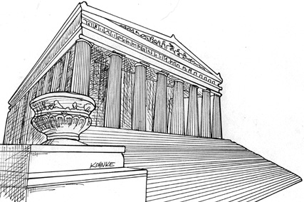

# Chap19. POLICY AND LEVEL



Software systems are statements of policy. Indeed, at its core, that’s all a computer program actually is. A computer program is a detailed description of the policy by which inputs are transformed into outputs.

In most nontrivial systems, that policy can be broken down into many different smaller statements of policy. Some of those statements will describe how particular business rules are to be calculated. Others will describe how certain reports are to be formatted. Still others will describe how input data are to be validated.

Part of the art of developing a software architecture is carefully separating those policies from one another, and regrouping them based on the ways that they change. Policies that change for the same reasons, and at the same times, are at the same level and belong together in the same component. Policies that change for different reasons, or at different times, are at different levels and should be separated into different components.

The art of architecture often involves forming the regrouped components into a directed acyclic graph. The nodes of the graph are the components that contain policies at the same level. The directed edges are the dependencies between those components. They connect components that are at different levels.

Those dependencies are source code, compile-time dependencies. In Java, they are import statements. In C#, they are using statements. In Ruby, they are require statements. They are the dependencies that are necessary for the compiler to function.

In a good architecture, the direction of those dependencies is based on the level of the components that they connect. In every case, low-level components are designed so that they depend on high-level components.

## LEVEL

A strict definition of “level” is “the distance from the inputs and outputs.” The farther a policy is from both the inputs and the outputs of the system, the higher its level. The policies that manage input and output are the lowest-level policies in the system.

The data flow diagram in Figure 19.1 depicts a simple encryption program that reads characters from an input device, translates the characters using a table, and then writes the translated characters to an output device. The data flows are shown as curved solid arrows. The properly designed source code dependencies are shown as straight dashed lines.

<Figures figure="19-1">A simple encryption program</Figures>

The Translate component is the highest-level component in this system because it is the component that is farthest from the inputs and outputs.1

Note that the data flows and the source code dependencies do not always point in the same direction. This, again, is part of the art of software architecture. We want source code dependencies to be decoupled from data flow and coupled to level.

It would be easy to create an incorrect architecture by writing the encryption program like this:


```js
function encrypt() {
  while (true) writeChar(translate(readChar()));
}
```

This is incorrect architecture because the high-level encrypt function depends on the lower-level readChar and writeChar functions.

A better architecture for this system is shown in the class diagram in Figure 19.2. Note the dashed border surrounding the Encrypt class, and the CharWriter and CharReader interfaces. All dependencies crossing that border point inward. This unit is the highest-level element in the system.

<Figures figure="19-2">Class diagram showing a better architecture for the system</Figures>

ConsoleReader and ConsoleWriter are shown here as classes. They are low level because they are close to the inputs and outputs.

Note how this structure decouples the high-level encryption policy from the lower-level input/output policies. This makes the encryption policy usable in a wide range of contexts. When changes are made to the input and output policies, they are not likely to affect the encryption policy.

Recall that policies are grouped into components based on the way that they change. Policies that change for the same reasons and at the same times are grouped together by the SRP and CCP. Higher-level policies—those that are farthest from the inputs and outputs—tend to change less frequently, and for more important reasons, than lower-level policies. Lower-level policies—those that are closest to the inputs and outputs—tend to change frequently, and with more urgency, but for less important reasons.

For example, even in the trivial example of the encryption program, it is far more likely that the IO devices will change than that the encryption algorithm will change. If the encryption algorithm does change, it will likely be for a more substantive reason than a change to one of the IO devices.

Keeping these policies separate, with all source code dependencies pointing in the direction of the higher-level policies, reduces the impact of change. Trivial but urgent changes at the lowest levels of the system have little or no impact on the higher, more important, levels.

Another way to look at this issue is to note that lower-level components should be plugins to the higher-level components. The component diagram in Figure 19.3 shows this arrangement. The Encryption component knows nothing of the IODevices component; the IODevices component depends on the Encryption component.

<Figures figure="19-3">Lower-level components should plug in to higher-level components</Figures>

## CONCLUSION

At this point, this discussion of policies has involved a mixture of the Single Responsibility Principle, the Open-Closed Principle, the Common Closure Principle, the Dependency Inversion Principle, the Stable Dependencies Principle, and the Stable Abstractions Principle. Look back and see if you can identify where each principle was used, and why.
