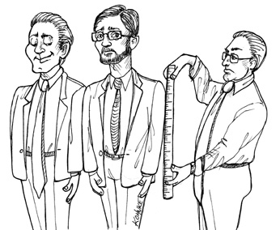

# Chap20. BUSINESS RULES

If we are going to divide our application into business rules and plugins, we’d better get a good grasp on just what business rules actually are. It turns out there are several different kinds.

Strictly speaking, business rules are rules or procedures that make or save the business money. Very strictly speaking, these rules would make or save the business money, irrespective of whether they were implemented on a computer. They would make or save money even if they were executed manually.

The fact that a bank charges N% interest for a loan is a business rule that makes the bank money. It doesn’t matter if a computer program calculates the interest, or if a clerk with an abacus calculates the interest.

We shall call these rules Critical Business Rules, because they are critical to the business itself, and would exist even if there were no system to automate them.

Critical Business Rules usually require some data to work with. For example, our loan requires a loan balance, an interest rate, and a payment schedule.

We shall call this data Critical Business Data. This is the data that would exist even if the system were not automated.

The critical rules and critical data are inextricably bound, so they are a good candidate for an object. We’ll call this kind of object an Entity.1

ENTITIES
An Entity is an object within our computer system that embodies a small set of critical business rules operating on Critical Business Data. The Entity object either contains the Critical Business Data or has very easy access to that data. The interface of the Entity consists of the functions that implement the Critical Business Rules that operate on that data.

For example, Figure 20.1 shows what our Loan entity might look like as a class in UML. It has three pieces of Critical Business Data, and presents three related Critical Business Rules at its interface.

<Figures figure="20-1">Loan entity as a class in UML</Figures>

When we create this kind of class, we are gathering together the software that implements a concept that is critical to the business, and separating it from every other concern in the automated system we are building. This class stands alone as a representative of the business. It is unsullied with concerns about databases, user interfaces, or third-party frameworks. It could serve the business in any system, irrespective of how that system was presented, or how the data was stored, or how the computers in that system were arranged. The Entity is pure business and nothing else.

Some of you may be concerned that I called it a class. Don’t be. You don’t need to use an object-oriented language to create an Entity. All that is required is that you bind the Critical Business Data and the Critical Business Rules together in a single and separate software module.

USE CASES
Not all business rules are as pure as Entities. Some business rules make or save money for the business by defining and constraining the way that an automated system operates. These rules would not be used in a manual environment, because they make sense only as part of an automated system.

For example, imagine an application that is used by bank officers to create a new loan. The bank may decide that it does not want the loan officers to offer loan payment estimates until they have first gathered, and validated, contact information and ensured that the candidate’s credit score is 500 or higher. For this reason, the bank may specify that the system will not proceed to the payment estimation screen until the contact information screen has been filled out and verified, and the credit score has been confirmed to be greater than the cutoff.

This is a use case.2 A use case is a description of the way that an automated system is used. It specifies the input to be provided by the user, the output to be returned to the user, and the processing steps involved in producing that output. A use case describes application-specific business rules as opposed to the Critical Business Rules within the Entities.

Figure 20.2 shows an example of a use case. Notice that in the last line it mentions the Customer. This is a reference to the Customer entity, which contains the Critical Business Rules that govern the relationship between the bank and its customers.

<Figures figure="20-2">Example use case</Figures>

Use cases contain the rules that specify how and when the Critical Business Rules within the Entities are invoked. Use cases control the dance of the Entities.

Notice also that the use case does not describe the user interface other than to informally specify the data coming in from that interface, and the data going back out through that interface. From the use case, it is impossible to tell whether the application is delivered on the web, or on a thick client, or on a console, or is a pure service.

This is very important. Use cases do not describe how the system appears to the user. Instead, they describe the application-specific rules that govern the interaction between the users and the Entities. How the data gets in and out of the system is irrelevant to the use cases.

A use case is an object. It has one or more functions that implement the application-specific business rules. It also has data elements that include the input data, the output data, and the references to the appropriate Entities with which it interacts.

Entities have no knowledge of the use cases that control them. This is another example of the direction of the dependencies following the Dependency Inversion Principle. High-level concepts, such as Entities, know nothing of lower-level concepts, such as use cases. Instead, the lower-level use cases know about the higher-level Entities.

Why are Entities high level and use cases lower level? Because use cases are specific to a single application and, therefore, are closer to the inputs and outputs of that system. Entities are generalizations that can be used in many different applications, so they are farther from the inputs and outputs of the system. Use cases depend on Entities; Entities do not depend on use cases.

REQUEST AND RESPONSE MODELS
Use cases expect input data, and they produce output data. However, a well-formed use case object should have no inkling about the way that data is communicated to the user, or to any other component. We certainly don’t want the code within the use case class to know about HTML or SQL!

The use case class accepts simple request data structures for its input, and returns simple response data structures as its output. These data structures are not dependent on anything. They do not derive from standard framework interfaces such as HttpRequest and HttpResponse. They know nothing of the web, nor do they share any of the trappings of whatever user interface might be in place.

This lack of dependencies is critical. If the request and response models are not independent, then the use cases that depend on them will be indirectly bound to whatever dependencies the models carry with them.

You might be tempted to have these data structures contain references to Entity objects. You might think this makes sense because the Entities and the request/response models share so much data. Avoid this temptation! The purpose of these two objects is very different. Over time they will change for very different reasons, so tying them together in any way violates the Common Closure and Single Responsibility Principles. The result would be lots of tramp data, and lots of conditionals in your code.

CONCLUSION
Business rules are the reason a software system exists. They are the core functionality. They carry the code that makes, or saves, money. They are the family jewels.

The business rules should remain pristine, unsullied by baser concerns such as the user interface or database used. Ideally, the code that represents the business rules should be the heart of the system, with lesser concerns being plugged in to them. The business rules should be the most independent and reusable code in the system.