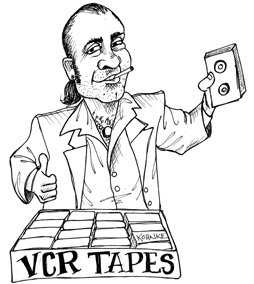

# 第 33 章 CASE STUDY: VIDEO SALES

Now it’s time to put these rules and thoughts about architecture together into a case study. This case study will be short and simple, yet will depict both the process a good architect uses and the decisions that such an architect makes.

THE PRODUCT
For this case study, I’ve chosen a product with which I am rather intimately familiar: the software for a website that sells videos. Of course, it is reminiscent of cleancoders.com, the site where I sell my software tutorial videos.

The basic idea is trivial. We have a batch of videos we want to sell. We sell them, on the web, to both individuals and businesses. Individuals can pay one price to stream the videos, and another, higher price to download those videos and own them permanently. Business licenses are streaming only, and are purchased in batches that allow quantity discounts.

Individuals typically act as both the viewers and the purchasers. Businesses, in contrast, often have people who buy the videos that other people will watch.

Video authors need to supply their video files, written descriptions, and ancillary files with exams, problems, solutions, source code, and other materials.

Administrators need to add new video series, add and delete videos to and from the series, and establish prices for various licenses.

Our first step in determining the initial architecture of the system is to identify the actors and use cases.

USE CASE ANALYSIS
Figure 33.1 shows a typical use-case analysis.

<Figures figure="33-1">A typical use-case analysis</Figures>

The four main actors are evident. According to the Single Responsibility Principle, these four actors will be the four primary sources of change for the system. Every time some new feature is added, or some existing feature is changed, that step will be taken to serve one of these actors. Therefore we want to partition the system such that a change to one actor does not affect any of the other actors.

The use cases shown in Figure 33.1 are not a complete list. For example, you won’t find log-in or log-out use cases. The reason for this omission is simply to manage the size of the problem in this book. If I were to include all the different use cases, then this chapter would have to turn into a book in its own right.

Note the dashed use cases in the center of Figure 33.1. They are abstract1 use cases. An abstract use case is one that sets a general policy that another use case will flesh out. As you can see, the View Catalog as Viewer and View Catalog as Purchaser use cases both inherit from the View Catalog abstract use case.

On the one hand, it was not strictly necessary for me to create that abstraction. I could have left the abstract use case out of the diagram without compromising any of the features of the overall product. On the other hand, these two use cases are so similar that I thought it wise to recognize the similarity and find a way to unify it early in the analysis.

COMPONENT ARCHITECTURE
Now that we know the actors and use cases, we can create a preliminary component architecture (Figure 33.2).

The double lines in the drawing represent architectural boundaries as usual. You can see the typical partitioning of views, presenters, interactors, and controllers. You can also see that I’ve broken each of those categories up by their corresponding actors.

Each of the components in Figure 33.2 represents a potential .jar file or .dll file. Each of those components will contain the views, presenters, interactors, and controllers that have been allocated to it.

Note the special components for the Catalog View and the Catalog Presenter. This is how I dealt with the abstract View Catalog use case. I assume that those views and presenters will be coded into abstract classes within those components, and that the inheriting components will contain view and presenter classes that will inherit from those abstract classes.

<Figures figure="33-2">A preliminary component architecture</Figures>

Would I really break the system up into all these components, and deliver them as .jar or .dll files? Yes and no. I would certainly break the compile and build environment up this way, so that I could build independent deliverables like that. I would also reserve the right to combine all those deliverables into a smaller number of deliverables if necessary. For example, given the partitioning in Figure 33.2, it would be easy to combine them into five .jar files—one for views, presenters, interactors, controllers, and utilities, respectively. I could then independently deploy the components that are most likely to change independently of each other.

Another possible grouping would be to put the views and presenters together into the same .jar file, and put the interactors, controllers, and utilities in their own .jar file. Still another, even more primitive, grouping would be to create two .jar files, with views and presenters in one file, and everything else in the other.

Keeping these options open will allow us to adapt the way we deploy the system based on how the system changes over time.

DEPENDENCY MANAGEMENT
The flow of control in Figure 33.2 proceeds from right to left. Input occurs at the controllers, and that input is processed into a result by the interactors. The presenters then format the results, and the views display those presentations.

Notice that the arrows do not all flow from the right to the left. In fact, most of them point from left to right. This is because the architecture is following the Dependency Rule. All dependencies cross the boundary lines in one direction, and they always point toward the components containing the higher-level policy.

Also notice that the using relationships (open arrows) point with the flow of control, and that the inheritance relationships (closed arrows) point against the flow of control. This depicts our use of the Open–Closed Principle to make sure that the dependencies flow in the right direction, and that changes to low-level details do not ripple upward to affect high-level policies.

CONCLUSION
The architecture diagram in Figure 33.2 includes two dimensions of separation. The first is the separation of actors based on the Single Responsibility Principle; the second is the Dependency Rule. The goal of both is to separate components that change for different reasons, and at different rates. The different reasons correspond to the actors; the different rates correspond to the different levels of policy.

Once you have structured the code this way, you can mix and match how you want to actually deploy the system. You can group the components into deployable deliverables in any way that makes sense, and easily change that grouping when conditions change.