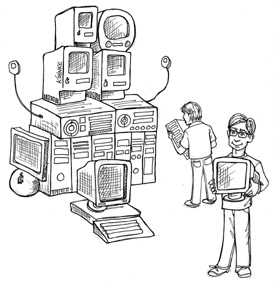

# 第 4 章 STRUCTURED PROGRAMMING

Edsger Wybe Dijkstra was born in Rotterdam in 1930. He survived the bombing of Rotterdam during World War II, along with the German occupation of the Netherlands, and in 1948 graduated from high school with the highest possible marks in math, physics, chemistry, and biology. In March 1952, at the age of 21 (and just 9 months before I was born), Dijkstra took a job with the Mathematical Center of Amsterdam as the Netherlands’ very first programmer.

In 1955, having been a programmer for three years, and while still a student, Dijkstra concluded that the intellectual challenge of programming was greater than the intellectual challenge of theoretical physics. As a result, he chose programming as his long-term career.

In 1957, Dijkstra married Maria Debets. At the time, you had to state your profession as part of the marriage rites in the Netherlands. The Dutch authorities were unwilling to accept “programmer” as Dijkstra’s profession; they had never heard of such a profession. To satisfy them, Dijkstra settled for “theoretical physicist” as his job title.

As part of deciding to make programming his career, Dijkstra conferred with his boss, Adriaan van Wijngaarden. Dijkstra was concerned that no one had identified a discipline, or science, of programming, and that he would therefore not be taken seriously. His boss replied that Dijkstra might very well be one of the people who would discover such disciplines, thereby evolving software into a science.

Dijkstra started his career in the era of vacuum tubes, when computers were huge, fragile, slow, unreliable, and (by today’s standards) extremely limited. In those early years, programs were written in binary, or in very crude assembly language. Input took the physical form of paper tape or punched cards. The edit/compile/test loop was hours—if not days—long.

It was in this primitive environment that Dijkstra made his great discoveries.

PROOF
The problem that Dijkstra recognized, early on, was that programming is hard, and that programmers don’t do it very well. A program of any complexity contains too many details for a human brain to manage without help. Overlooking just one small detail results in programs that may seem to work, but fail in surprising ways.

Dijkstra’s solution was to apply the mathematical discipline of proof. His vision was the construction of a Euclidian hierarchy of postulates, theorems, corollaries, and lemmas. Dijkstra thought that programmers could use that hierarchy the way mathematicians do. In other words, programmers would use proven structures, and tie them together with code that they would then prove correct themselves.

Of course, to get this going, Dijkstra realized that he would have to demonstrate the technique for writing basic proofs of simple algorithms. This he found to be quite challenging.

During his investigation, Dijkstra discovered that certain uses of goto statements prevent modules from being decomposed recursively into smaller and smaller units, thereby preventing use of the divide-and-conquer approach necessary for reasonable proofs.

Other uses of goto, however, did not have this problem. Dijkstra realized that these “good” uses of goto corresponded to simple selection and iteration control structures such as if/then/else and do/while. Modules that used only those kinds of control structures could be recursively subdivided into provable units.

Dijkstra knew that those control structures, when combined with sequential execution, were special. They had been identified two years before by Böhm and Jacopini, who proved that all programs can be constructed from just three structures: sequence, selection, and iteration.

This discovery was remarkable: The very control structures that made a module provable were the same minimum set of control structures from which all programs can be built. Thus structured programming was born.

Dijkstra showed that sequential statements could be proved correct through simple enumeration. The technique mathematically traced the inputs of the sequence to the outputs of the sequence. This approach was no different from any normal mathematical proof.

Dijkstra tackled selection through reapplication of enumeration. Each path through the selection was enumerated. If both paths eventually produced appropriate mathematical results, then the proof was solid.

Iteration was a bit different. To prove an iteration correct, Dijkstra had to use induction. He proved the case for 1 by enumeration. Then he proved the case that if N was assumed correct, N + 1 was correct, again by enumeration. He also proved the starting and ending criteria of the iteration by enumeration.

Such proofs were laborious and complex—but they were proofs. With their development, the idea that a Euclidean hierarchy of theorems could be constructed seemed reachable.

A HARMFUL PROCLAMATION
In 1968, Dijkstra wrote a letter to the editor of CACM, which was published in the March issue. The title of this letter was “Go To Statement Considered Harmful.” The article outlined his position on the three control structures.

And the programming world caught fire. Back then we didn’t have an Internet, so people couldn’t post nasty memes of Dijkstra, and they couldn’t flame him online. But they could, and they did, write letters to the editors of many published journals.

Those letters weren’t necessarily all polite. Some were intensely negative; others voiced strong support for his position. And so the battle was joined, ultimately to last about a decade.

Eventually the argument petered out. The reason was simple: Dijkstra had won. As computer languages evolved, the goto statement moved ever rearward, until it all but disappeared. Most modern languages do not have a goto statement—and, of course, LISP never did.

Nowadays we are all structured programmers, though not necessarily by choice. It’s just that our languages don’t give us the option to use undisciplined direct transfer of control.

Some may point to named breaks in Java or exceptions as goto analogs. In fact, these structures are not the utterly unrestricted transfers of control that older languages like Fortran or COBOL once had. Indeed, even languages that still support the goto keyword often restrict the target to within the scope of the current function.

FUNCTIONAL DECOMPOSITION
Structured programming allows modules to be recursively decomposed into provable units, which in turn means that modules can be functionally decomposed. That is, you can take a large-scale problem statement and decompose it into high-level functions. Each of those functions can then be decomposed into lower-level functions, ad infinitum. Moreover, each of those decomposed functions can be represented using the restricted control structures of structured programming.

Building on this foundation, disciplines such as structured analysis and structured design became popular in the late 1970s and throughout the 1980s. Men like Ed Yourdon, Larry Constantine, Tom DeMarco, and Meilir Page-Jones promoted and popularized these techniques throughout that period. By following these disciplines, programmers could break down large proposed systems into modules and components that could be further broken down into tiny provable functions.

NO FORMAL PROOFS
But the proofs never came. The Euclidean hierarchy of theorems was never built. And programmers at large never saw the benefits of working through the laborious process of formally proving each and every little function correct. In the end, Dijkstra’s dream faded and died. Few of today’s programmers believe that formal proofs are an appropriate way to produce high-quality software.

Of course, formal, Euclidian style, mathematical proofs are not the only strategy for proving something correct. Another highly successful strategy is the scientific method.

SCIENCE TO THE RESCUE
Science is fundamentally different from mathematics, in that scientific theories and laws cannot be proven correct. I cannot prove to you that Newton’s second law of motion, F = ma, or law of gravity, F = Gm1m2/r2, are correct. I can demonstrate these laws to you, and I can make measurements that show them correct to many decimal places, but I cannot prove them in the sense of a mathematical proof. No matter how many experiments I conduct or how much empirical evidence I gather, there is always the chance that some experiment will show that those laws of motion and gravity are incorrect.

That is the nature of scientific theories and laws: They are falsifiable but not provable.

And yet we bet our lives on these laws every day. Every time you get into a car, you bet your life that F = ma is a reliable description of the way the world works. Every time you take a step, you bet your health and safety that F = Gm1m2/r2 is correct.

Science does not work by proving statements true, but rather by proving statements false. Those statements that we cannot prove false, after much effort, we deem to be true enough for our purposes.

Of course, not all statements are provable. The statement “This is a lie” is neither true nor false. It is one of the simplest examples of a statement that is not provable.

Ultimately, we can say that mathematics is the discipline of proving provable statements true. Science, in contrast, is the discipline of proving provable statements false.

TESTS
Dijkstra once said, “Testing shows the presence, not the absence, of bugs.” In other words, a program can be proven incorrect by a test, but it cannot be proven correct. All that tests can do, after sufficient testing effort, is allow us to deem a program to be correct enough for our purposes.

The implications of this fact are stunning. Software development is not a mathematical endeavor, even though it seems to manipulate mathematical constructs. Rather, software is like a science. We show correctness by failing to prove incorrectness, despite our best efforts.

Such proofs of incorrectness can be applied only to provable programs. A program that is not provable—due to unrestrained use of goto, for example—cannot be deemed correct no matter how many tests are applied to it.

Structured programming forces us to recursively decompose a program into a set of small provable functions. We can then use tests to try to prove those small provable functions incorrect. If such tests fail to prove incorrectness, then we deem the functions to be correct enough for our purposes.

CONCLUSION
It is this ability to create falsifiable units of programming that makes structured programming valuable today. This is the reason that modern languages do not typically support unrestrained goto statements. Moreover, at the architectural level, this is why we still consider functional decomposition to be one of our best practices.

At every level, from the smallest function to the largest component, software is like a science and, therefore, is driven by falsifiability. Software architects strive to define modules, components, and services that are easily falsifiable (testable). To do so, they employ restrictive disciplines similar to structured programming, albeit at a much higher level.

It is those restrictive disciplines that we will study in some detail in the chapters to come.