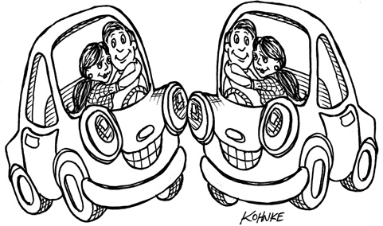

# Chap14. COMPONENT COUPLING

The next three principles deal with the relationships between components. Here again we will run into the tension between develop-ability and logical design. The forces that impinge upon the architecture of a component structure are technical, political, and volatile.

## THE ACYCLIC DEPENDENCIES PRINCIPLE

Allow no cycles in the component dependency graph.

Have you ever worked all day, gotten some stuff working, and then gone home, only to arrive the next morning to find that your stuff no longer works? Why doesn’t it work? Because somebody stayed later than you and changed something you depend on! I call this “the morning after syndrome.”

The “morning after syndrome” occurs in development environments where many developers are modifying the same source files. In relatively small projects with just a few developers, it isn’t too big a problem. But as the size of the project and the development team grow, the mornings after can get pretty nightmarish. It is not uncommon for weeks to go by without the team being able to build a stable version of the project. Instead, everyone keeps on changing and changing their code trying to make it work with the last changes that someone else made.

Over the last several decades, two solutions to this problem have evolved, both of which came from the telecommunications industry. The first is “the weekly build,” and the second is the Acyclic Dependencies Principle (ADP).

### THE WEEKLY BUILD

The weekly build used to be common in medium-sized projects. It works like this: All the developers ignore each other for the first four days of the week. They all work on private copies of the code, and don’t worry about integrating their work on a collective basis. Then, on Friday, they integrate all their changes and build the system.

This approach has the wonderful advantage of allowing the developers to live in an isolated world for four days out of five. The disadvantage, of course, is the large integration penalty that is paid on Friday.

Unfortunately, as the project grows, it becomes less feasible to finish integrating the project on Friday. The integration burden grows until it starts to overflow into Saturday. A few such Saturdays are enough to convince the developers that integration should really begin on Thursday—and so the start of integration slowly creeps toward the middle of the week.

As the duty cycle of development versus integration decreases, the efficiency of the team decreases, too. Eventually this situation becomes so frustrating that the developers, or the project managers, declare that the schedule should be changed to a biweekly build. This suffices for a time, but the integration time continues to grow with project size.

Eventually, this scenario leads to a crisis. To maintain efficiency, the build schedule has to be continually lengthened—but lengthening the build schedule increases project risks. Integration and testing become increasingly harder to do, and the team loses the benefit of rapid feedback.

### ELIMINATING DEPENDENCY CYCLES

The solution to this problem is to partition the development environment into releasable components. The components become units of work that can be the responsibility of a single developer, or a team of developers. When developers get a component working, they release it for use by the other developers. They give it a release number and move it into a directory for other teams to use. They then continue to modify their component in their own private areas. Everyone else uses the released version.

As new releases of a component are made available, other teams can decide whether they will immediately adopt the new release. If they decide not to, they simply continue using the old release. Once they decide that they are ready, they begin to use the new release.

Thus no team is at the mercy of the others. Changes made to one component do not need to have an immediate affect on other teams. Each team can decide for itself when to adapt its own components to new releases of the components. Moreover, integration happens in small increments. There is no single point in time when all developers must come together and integrate everything they are doing.

This is a very simple and rational process, and it is widely used. To make it work successfully, however, you must manage the dependency structure of the components. There can be no cycles. If there are cycles in the dependency structure, then the “morning after syndrome” cannot be avoided.

Consider the component diagram in Figure 14.1. It shows a rather typical structure of components assembled into an application. The function of this application is unimportant for the purpose of this example. What is important is the dependency structure of the components. Notice that this structure is a directed graph. The components are the nodes, and the dependency relationships are the directed edges.

<Figures figure="14-1">Typical component diagram</Figures>

Notice one more thing: Regardless of which component you begin at, it is impossible to follow the dependency relationships and wind up back at that component. This structure has no cycles. It is a directed acyclic graph (DAG).

Now consider what happens when the team responsible for Presenters makes a new release of their component. It is easy to find out who is affected by this release; you just follow the dependency arrows backward. Thus View and Main will both be affected. The developers currently working on those components will have to decide when they should integrate their work with the new release of Presenters.

Notice also that when Main is released, it has utterly no effect on any of the other components in the system. They don’t know about Main, and they don’t care when it changes. This is nice. It means that the impact of releasing Main is relatively small.

When the developers working on the Presenters component would like to run a test of that component, they just need to build their version of Presenters with the versions of the Interactors and Entities components that they are currently using. None of the other components in the system need be involved. This is nice. It means that the developers working on Presenters have relatively little work to do to set up a test, and that they have relatively few variables to consider.

When it is time to release the whole system, the process proceeds from the bottom up. First the Entities component is compiled, tested, and released. Then the same is done for Database and Interactors. These components are followed by Presenters, View, Controllers, and then Authorizer. Main goes last. This process is very clear and easy to deal with. We know how to build the system because we understand the dependencies between its parts.

### THE EFFECT OF A CYCLE IN THE COMPONENT DEPENDENCY GRAPH

Suppose that a new requirement forces us to change one of the classes in Entities such that it makes use of a class in Authorizer. For example, let’s say that the User class in Entities uses the Permissions class in Authorizer. This creates a dependency cycle, as shown in Figure 14.2.

This cycle creates some immediate problems. For example, the developers working on the Database component know that to release it, the component must be compatible with Entities. However, with the cycle in place, the Database component must now also be compatible with Authorizer. But Authorizer depends on Interactors. This makes Database much more difficult to release. Entities, Authorizer, and Interactors have, in effect, become one large component—which means that all of the developers working on any of those components will experience the dreaded “morning after syndrome.” They will be stepping all over one another because they must all use exactly the same release of one another’s components.

<Figures figure="14-2">A dependency cycle</Figures>

But this is just part of the trouble. Consider what happens when we want to test the Entities component. To our chagrin, we find that we must build and integrate with Authorizer and Interactors. This level of coupling between components is troubling, if not intolerable.

You may have wondered why you have to include so many different libraries, and so much of everybody else’s stuff, just to run a simple unit test of one of your classes. If you investigate the matter a bit, you will probably discover that there are cycles in the dependency graph. Such cycles make it very difficult to isolate components. Unit testing and releasing become very difficult and error prone. In addition, build issues grow geometrically with the number of modules.

Moreover, when there are cycles in the dependency graph, it can be very difficult to work out the order in which you must build the components. Indeed, there probably is no correct order. This can lead to some very nasty problems in languages like Java that read their declarations from compiled binary files.

### BREAKING THE CYCLE

It is always possible to break a cycle of components and reinstate the dependency graph as a DAG. There are two primary mechanisms for doing so:

1. Apply the Dependency Inversion Principle (DIP). In the case in Figure 14.3, we could create an interface that has the methods that User needs. We could then put that interface into Entities and inherit it into Authorizer. This inverts the dependency between Entities and Authorizer, thereby breaking the cycle.

<Figures figure="14-3">Inverting the dependency between Entities and Authorizer</Figures>

2. Create a new component that both Entities and Authorizer depend on. Move the class(es) that they both depend on into that new component (Figure 14.4).

<Figures figure="14-4">The new component that both Entities and Authorizer depend on</Figures>

### THE “JITTERS”

The second solution implies that the component structure is volatile in the presence of changing requirements. Indeed, as the application grows, the component dependency structure jitters and grows. Thus the dependency structure must always be monitored for cycles. When cycles occur, they must be broken somehow. Sometimes this will mean creating new components, making the dependency structure grow.

## TOP-DOWN DESIGN

The issues we have discussed so far lead to an inescapable conclusion: The component structure cannot be designed from the top down. It is not one of the first things about the system that is designed, but rather evolves as the system grows and changes.

Some readers may find this point to be counterintuitive. We have come to expect that large-grained decompositions, like components, will also be high-level functional decompositions.

When we see a large-grained grouping such as a component dependency structure, we believe that the components ought to somehow represent the functions of the system. Yet this does not seem to be an attribute of component dependency diagrams.

In fact, component dependency diagrams have very little do to with describing the function of the application. Instead, they are a map to the buildability and maintainability of the application. This is why they aren’t designed at the beginning of the project. There is no software to build or maintain, so there is no need for a build and maintenance map. But as more and more modules accumulate in the early stages of implementation and design, there is a growing need to manage the dependencies so that the project can be developed without the “morning after syndrome.” Moreover, we want to keep changes as localized as possible, so we start paying attention to the SRP and CCP and collocate classes that are likely to change together.

One of the overriding concerns with this dependency structure is the isolation of volatility. We don’t want components that change frequently and for capricious reasons to affect components that otherwise ought to be stable. For example, we don’t want cosmetic changes to the GUI to have an impact on our business rules. We don’t want the addition or modification of reports to have an impact on our highest-level policies. Consequently, the component dependency graph is created and molded by architects to protect stable high-value components from volatile components.

As the application continues to grow, we start to become concerned about creating reusable elements. At this point, the CRP begins to influence the composition of the components. Finally, as cycles appear, the ADP is applied and the component dependency graph jitters and grows.

If we tried to design the component dependency structure before we designed any classes, we would likely fail rather badly. We would not know much about common closure, we would be unaware of any reusable elements, and we would almost certainly create components that produced dependency cycles. Thus the component dependency structure grows and evolves with the logical design of the system.

## THE STABLE DEPENDENCIES PRINCIPLE

Depend in the direction of stability.

Designs cannot be completely static. Some volatility is necessary if the design is to be maintained. By conforming to the Common Closure Principle (CCP), we create components that are sensitive to certain kinds of changes but immune to others. Some of these components are designed to be volatile. We expect them to change.

Any component that we expect to be volatile should not be depended on by a component that is difficult to change. Otherwise, the volatile component will also be difficult to change.

It is the perversity of software that a module that you have designed to be easy to change can be made difficult to change by someone else who simply hangs a dependency on it. Not a line of source code in your module need change, yet your module will suddenly become more challenging to change. By conforming to the Stable Dependencies Principle (SDP), we ensure that modules that are intended to be easy to change are not depended on by modules that are harder to change.

### STABILITY

What is meant by “stability”? Stand a penny on its side. Is it stable in that position? You would likely say “no.” However, unless disturbed, it will remain in that position for a very long time. Thus stability has nothing directly to do with frequency of change. The penny is not changing, but it is difficult to think of it as stable.

Webster’s Dictionary says that something is stable if it is “not easily moved.” Stability is related to the amount of work required to make a change. On the one hand, the standing penny is not stable because it requires very little work to topple it. On the other hand, a table is very stable because it takes a considerable amount of effort to turn it over.

How does this relate to software? Many factors may make a software component hard to change—for example, its size, complexity, and clarity, among other characteristics. We will ignore all those factors and focus on something different here. One sure way to make a software component difficult to change, is to make lots of other software components depend on it. A component with lots of incoming dependencies is very stable because it requires a great deal of work to reconcile any changes with all the dependent components.

The diagram in Figure 14.5 shows X, which is a stable component. Three components depend on X, so it has three good reasons not to change. We say that X is responsible to those three components. Conversely, X depends on nothing, so it has no external influence to make it change. We say it is independent.

<Figures figure="14-5">X: a stable component</Figures>

Figure 14.6 shows Y, which is a very unstable component. No other components depend on Y, so we say that it is irresponsible. Y also has three components that it depends on, so changes may come from three external sources. We say that Y is dependent.

<Figures figure="14-6">Y: a very unstable component</Figures>

### STABILITY METRICS

How can we measure the stability of a component? One way is to count the number of dependencies that enter and leave that component. These counts will allow us to calculate the positional stability of the component.

- Fan-in: Incoming dependencies. This metric identifies the number of classes outside this component that depend on classes within the component.
- Fan-out: Outgoing dependencies. This metric identifies the number of classes inside this component that depend on classes outside the component.
- I: Instability: I = Fan-out / (Fan-in + Fan-out). This metric has the range [0, 1]. I = 0 indicates a maximally stable component. I = 1 indicates a maximally unstable component.

The Fan-in and Fan-out metrics1 are calculated by counting the number of classes outside the component in question that have dependencies with the classes inside the component in question. Consider the example in Figure 14.7.

<Figures figure="14-7">Our example</Figures>

Let’s say we want to calculate the stability of the component Cc. We find that there are three classes outside Cc that depend on classes in Cc. Thus, Fan-in = 3. Moreover, there is one class outside Cc that classes in Cc depend on. Thus, Fan-out = 1 and I = 1/4.

In C++, these dependencies are typically represented by #include statements. Indeed, the I metric is easiest to calculate when you have organized your source code such that there is one class in each source file. In Java, the I metric can be calculated by counting import statements and qualified names.

When the I metric is equal to 1, it means that no other component depends on this component (Fan-in = 0), and this component depends on other components (Fan-out > 0). This situation is as unstable as a component can get; it is irresponsible and dependent. Its lack of dependents gives the component no reason not to change, and the components that it depends on may give it ample reason to change.

In contrast, when the I metric is equal to 0, it means that the component is depended on by other components (Fan-in > 0), but does not itself depend on any other components (Fan-out = 0). Such a component is responsible and independent. It is as stable as it can get. Its dependents make it hard to change the component, and its has no dependencies that might force it to change.

The SDP says that the I metric of a component should be larger than the I metrics of the components that it depends on. That is, I metrics should decrease in the direction of dependency.

### NOT ALL COMPONENTS SHOULD BE STABLE

If all the components in a system were maximally stable, the system would be unchangeable. This is not a desirable situation. Indeed, we want to design our component structure so that some components are unstable and some are stable. The diagram in Figure 14.8 shows an ideal configuration for a system with three components.

The changeable components are on top and depend on the stable component at the bottom. Putting the unstable components at the top of the diagram is a useful convention because any arrow that points up is violating the SDP (and, as we shall see later, the ADP).

<Figures figure="14-8">An ideal configuration for a system with three components</Figures>

The diagram in Figure 14.9 shows how the SDP can be violated.

<Figures figure="14-9">SDP violation</Figures>

Flexible is a component that we have designed to be easy to change. We want Flexible to be unstable. However, some developer, working in the component named Stable, has hung a dependency on Flexible. This violates the SDP because the I metric for Stable is much smaller than the I metric for Flexible. As a result, Flexible will no longer be easy to change. A change to Flexible will force us to deal with Stable and all its dependents.

To fix this problem, we somehow have to break the dependence of Stable on Flexible. Why does this dependency exist? Let’s assume that there is a class C within Flexible that another class U within Stable needs to use (Figure 14.10).

<Figures figure="14-10">U within Stable uses C within Flexible</Figures>

We can fix this by employing the DIP. We create an interface class called US and put it in a component named UServer. We make sure that this interface declares all the methods that U needs to use. We then make C implement this interface as shown in Figure 14.11. This breaks the dependency of Stable on Flexible, and forces both components to depend on UServer. UServer is very stable (I = 0), and Flexible retains its necessary instability (I = 1). All the dependencies now flow in the direction of decreasing I.

<Figures figure="14-11">C implements the interface class US</Figures>

### Abstract Components

You may find it strange that we would create a component—in this example, UService—that contains nothing but an interface. Such a component contains no executable code! It turns out, however, that this is a very common, and necessary, tactic when using statically typed languages like Java and C#. These abstract components are very stable and, therefore, are ideal targets for less stable components to depend on.

When using dynamically typed languages like Ruby and Python, these abstract components don’t exist at all, nor do the dependencies that would have targeted them. Dependency structures in these languages are much simpler because dependency inversion does not require either the declaration or the inheritance of interfaces.

## THE STABLE ABSTRACTIONS PRINCIPLE

A component should be as abstract as it is stable.

### WHERE DO WE PUT THE HIGH-LEVEL POLICY?

Some software in the system should not change very often. This software represents high-level architecture and policy decisions. We don’t want these business and architectural decisions to be volatile. Thus the software that encapsulates the high-level policies of the system should be placed into stable components (I = 0). Unstable components (I = 1) should contain only the software that is volatile—software that we want to be able to quickly and easily change.

However, if the high-level policies are placed into stable components, then the source code that represents those policies will be difficult to change. This could make the overall architecture inflexible. How can a component that is maximally stable (I = 0) be flexible enough to withstand change? The answer is found in the OCP. This principle tells us that it is possible and desirable to create classes that are flexible enough to be extended without requiring modification. Which kind of classes conform to this principle? Abstract classes.

### INTRODUCING THE STABLE ABSTRACTIONS PRINCIPLE

The Stable Abstractions Principle (SAP) sets up a relationship between stability and abstractness. On the one hand, it says that a stable component should also be abstract so that its stability does not prevent it from being extended. On the other hand, it says that an unstable component should be concrete since its instability allows the concrete code within it to be easily changed.

Thus, if a component is to be stable, it should consist of interfaces and abstract classes so that it can be extended. Stable components that are extensible are flexible and do not overly constrain the architecture.

The SAP and the SDP combined amount to the DIP for components. This is true because the SDP says that dependencies should run in the direction of stability, and the SAP says that stability implies abstraction. Thus dependencies run in the direction of abstraction.

The DIP, however, is a principle that deals with classes—and with classes there are no shades of gray. Either a class is abstract or it is not. The combination of the SDP and the SAP deals with components, and allows that a component can be partially abstract and partially stable.

### MEASURING ABSTRACTION

The A metric is a measure of the abstractness of a component. Its value is simply the ratio of interfaces and abstract classes in a component to the total number of classes in the component.

- Nc: The number of classes in the component.
- Na: The number of abstract classes and interfaces in the component.
- A: Abstractness. A = Na ÷ Nc.

The A metric ranges from 0 to 1. A value of 0 implies that the component has no abstract classes at all. A value of 1 implies that the component contains nothing but abstract classes.

### THE MAIN SEQUENCE

We are now in a position to define the relationship between stability (I) and abstractness (A). To do so, we create a graph with A on the vertical axis and I on the horizontal axis (Figure 14.12). If we plot the two “good” kinds of components on this graph, we will find the components that are maximally stable and abstract at the upper left at (0, 1). The components that are maximally unstable and concrete are at the lower right at (1, 0).

<Figures figure="14-12">The I/A graph</Figures>

Not all components fall into one of these two positions, because components often have degrees of abstraction and stability. For example, it is very common for one abstract class to derive from another abstract class. The derivative is an abstraction that has a dependency. Thus, though it is maximally abstract, it will not be maximally stable. Its dependency will decrease its stability.

Since we cannot enforce a rule that all components sit at either (0, 1) or (1, 0), we must assume that there is a locus of points on the A/I graph that defines reasonable positions for components. We can infer what that locus is by finding the areas where components should not be—in other words, by determining the zones of exclusion (Figure 14.13).

<Figures figure="14-13">Zones of exclusion</Figures>

### The Zone of Pain

Consider a component in the area of (0, 0). This is a highly stable and concrete component. Such a component is not desirable because it is rigid. It cannot be extended because it is not abstract, and it is very difficult to change because of its stability. Thus we do not normally expect to see well-designed components sitting near (0, 0). The area around (0, 0) is a zone of exclusion called the Zone of Pain.

Some software entities do, in fact, fall within the Zone of Pain. An example would be a database schema. Database schemas are notoriously volatile, extremely concrete, and highly depended on. This is one reason why the interface between OO applications and databases is so difficult to manage, and why schema updates are generally painful.

Another example of software that sits near the area of (0, 0) is a concrete utility library. Although such a library has an I metric of 1, it may actually be nonvolatile. Consider the String component, for example. Even though all the classes within it are concrete, it is so commonly used that changing it would create chaos. Therefore String is nonvolatile.

Nonvolatile components are harmless in the (0, 0) zone since they are not likely to be changed. For that reason, it is only volatile software components that are problematic in the Zone of Pain. The more volatile a component in the Zone of Pain, the more “painful” it is. Indeed, we might consider volatility to be a third axis of the graph. With this understanding, Figure 14.13 shows only the most painful plane, where volatility = 1.

### The Zone of Uselessness

Consider a component near (1, 1). This location is undesirable because it is maximally abstract, yet has no dependents. Such components are useless. Thus this area is called the Zone of Uselessness.

The software entities that inhabit this region are a kind of detritus. They are often leftover abstract classes that no one ever implemented. We find them in systems from time to time, sitting in the code base, unused.

A component that has a position deep within the Zone of Uselessness must contain a significant fraction of such entities. Clearly, the presence of such useless entities is undesirable.

### AVOIDING THE ZONES OF EXCLUSION

It seems clear that our most volatile components should be kept as far from both zones of exclusion as possible. The locus of points that are maximally distant from each zone is the line that connects (1, 0) and (0, 1). I call this line the Main Sequence.2

A component that sits on the Main Sequence is not “too abstract” for its stability, nor is it “too unstable” for its abstractness. It is neither useless nor particularly painful. It is depended on to the extent that it is abstract, and it depends on others to the extent that it is concrete.

The most desirable position for a component is at one of the two endpoints of the Main Sequence. Good architects strive to position the majority of their components at those endpoints. However, in my experience, some small fraction of the components in a large system are neither perfectly abstract nor perfectly stable. Those components have the best characteristics if they are on, or close, to the Main Sequence.

### DISTANCE FROM THE MAIN SEQUENCE

This leads us to our last metric. If it is desirable for components to be on, or close, to the Main Sequence, then we can create a metric that measures how far away a component is from this ideal.

- D3: Distance. D = |A+I–1| . The range of this metric is [0, 1]. A value of 0 indicates that the component is directly on the Main Sequence. A value of 1 indicates that the component is as far away as possible from the Main Sequence.

Given this metric, a design can be analyzed for its overall conformance to the Main Sequence. The D metric for each component can be calculated. Any component that has a D value that is not near zero can be reexamined and restructured.

Statistical analysis of a design is also possible. We can calculate the mean and variance of all the D metrics for the components within a design. We would expect a conforming design to have a mean and variance that are close to zero. The variance can be used to establish “control limits” so as to identify components that are “exceptional” in comparison to all the others.

In the scatterplot in Figure 14.14, we see that the bulk of the components lie along the Main Sequence, but some of them are more than one standard deviation (Z = 1) away from the mean. These aberrant components are worth examining more closely. For some reason, they are either very abstract with few dependents or very concrete with many dependents.

<Figures figure="14-14">Scatterplot of the components</Figures>

Another way to use the metrics is to plot the D metric of each component over time. The graph in Figure 14.15 is a mock-up of such a plot. You can see that some strange dependencies have been creeping into the Payroll component over the last few releases. The plot shows a control threshold at D = 0.1. The R2.1 point has exceeded this control limit, so it would be worth our while to find out why this component is so far from the main sequence.

<Figures figure="14-15">Plot of D for a single component over time</Figures>

## CONCLUSION

The dependency management metrics described in this chapter measure the conformance of a design to a pattern of dependency and abstraction that I think is a “good” pattern. Experience has shown that certain dependencies are good and others are bad. This pattern reflects that experience. However, a metric is not a god; it is merely a measurement against an arbitrary standard. These metrics are imperfect, at best, but it is my hope that you find them useful.
